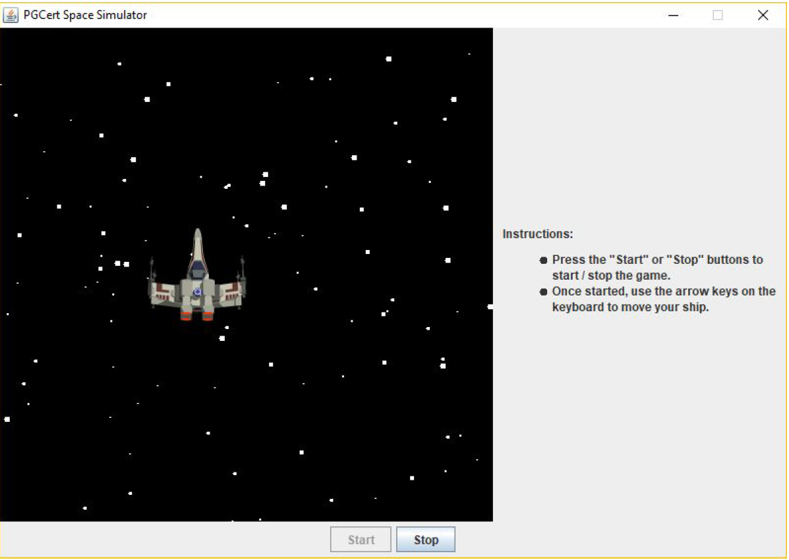
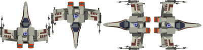

# A Space Game

---

In this question, we'll complete the code for a simple game which allows the user to fly a 2D spaceship around the screen. The completed app is shown in the screenshot below.

When the user clicks the "start" button, the starfield in the background will animate. Then, the user will be able to fly the ship up, down, left, or right by pressing the corresponding arrow key on the keyboard. The ship's graphic will change to indicate the direction it is currently flying. The user will not be able to move the ship outside the visible area - if they try, the ship will stop at the edge.

The app, as given to you, will simply render a black square - you won't be able to see the stars or ship. To complete the app, perform the following tasks:

---

1. **Complete the Star class.** This class is intended to represent a single star in the starfield. It contains variables representing its position, size, and speed. To complete this class:

- Implement the `move()` method. Each time this method is called, the star should move down by a number of pixels specified by its speed . Then, if the star has moved off the bottom of the screen (whose height is given by the `windowHeight` variable), it should appear back at the top of the screen.

-  Implement the `paint()` method. Each time this method is called, a white filled oval should be drawn at the star's location. The width and height of the oval should both be the star's `size`.

---

2. **Complete the Starfield class.** This class is intended to represent all the stars in the game. It contains a List of [`Star`](src/main/java/ictgradschool/industry/practical/swing/spaceship/Star.java) objects to be animated / drawn. To complete this class:

- Implement the constructor. This constructor should appropriately initialize the stars list, and fill it with 100 stars. Each star should have:

    - A random `x`, between 0 (incl.) and the given `width` (excl.)
    - A random `y`, between 0 (incl.) and the given `height` (excl.)
    - A random `size`, between 2 (incl.) and 6 (incl.)
    - A random `speed`, between 5 (incl.) and 11 (incl.)

- Implement the `move()` method. This method should loop through all the stars and appropriately call their `move` methods.

- Implement the `paint()` method. This method should loop through all the stars and appropriately call their `paint` methods.

---

3. **Complete the paintComponent() method in the SpacePanel class**. Currently, this method simply draws a black rectangle. Modify the method so that it additionally paints the starfield and the spaceship. The spaceship should be drawn on top of the starfield. Once you've done this, you should be able to run the app and see these objects on-screen (though they won't move yet).

---

4. **Add a Timer** . Currently, when the "start" button is clicked, [`SpacePanel`](src/main/java/ictgradschool/industry/practical/swing/spaceship/SpacePanel.java)'s `start()` method is called (the code for this is in the `SpaceApp` class). Similarly, [`SpacePanel`](src/main/java/ictgradschool/industry/practical/swing/spaceship/SpacePanel.java)'s `stop()` method is called when the "stop" button is clicked. But these methods don't do anything yet. We'll add a Swing `Timer` to [`SpacePanel`](src/main/java/ictgradschool/industry/practical/swing/spaceship/SpacePanel.java) to allow the game to animate. To do this:

- Have [`SpacePanel`](src/main/java/ictgradschool/industry/practical/swing/spaceship/SpacePanel.java) implement the `ActionListener` interface. Then, in the appropriate method, call the starfield's `move()` method. Then, call the appropriate method which will allow the game to repaint itself. Hint: The width and height of [`SpacePanel`](src/main/java/ictgradschool/industry/practical/swing/spaceship/SpacePanel.java) can be obtained using its `getWidth()` and `getHeight()` methods.

- In [`SpacePanel`](src/main/java/ictgradschool/industry/practical/swing/spaceship/SpacePanel.java)'s constructor, initialize the timer instance variable to a new timer, with a delay of 20ms, and `this` as its action listener.

- In [`SpacePanel`](src/main/java/ictgradschool/industry/practical/swing/spaceship/SpacePanel.java)'s `start()` method, start the timer. In its `stop()` method, stop the timer. Once this is done, you should be able to run the app and click the "start" button to see the starfield animate. The animation should stop when the "stop" button is clicked.

---

5. **Move the Spaceship (part 1).** Currently, there's a variable in [`SpacePanel`](src/main/java/ictgradschool/industry/practical/swing/spaceship/SpacePanel.java) called `moveDirection` , which is intended to store the direction the spaceship should move each time the timer ticks. We want to change this value based on the user's key presses, and supply it to the [`Spaceship`](src/main/java/ictgradschool/industry/practical/swing/spaceship/Spaceship.java) class, which should then move appropriately. To do this:

- Have [`SpacePanel`](src/main/java/ictgradschool/industry/practical/swing/spaceship/SpacePanel.java) implement the `KeyListener` interface. In an appropriate method, set the value of the moveDirection variable based on the key code of the supplied `KeyEvent`. If the key code is `VK_UP` (the "Up" arrow on the keyboard), `moveDirection` should be set to `Direction.Up`. Similar key codes for the other three keyboard arrows should be mapped to the other three directions. If any other key code is detected, `moveDirection` should be set to `Direction.None`. `moveDirection` should also be set to this value when the user releases a key.

- At an appropriate location within the method you added in step 4, add code which will call [`Spaceship`](src/main/java/ictgradschool/industry/practical/swing/spaceship/Spaceship.java)'s `move()` method, supplying appropriate arguments.

- Also within this method, add a call to the `requestFocusInWindow()` method. This will allow the panel to continue to receive key press events even if the user clicks another component (for example, the buttons).

- At an appropriate location within the code, remember to add [`SpacePanel`](src/main/java/ictgradschool/industry/practical/swing/spaceship/SpacePanel.java) as a key listener on itself.

---

6. **Move the Spaceship (part 2).** Now that [`Spaceship`](src/main/java/ictgradschool/industry/practical/swing/spaceship/Spaceship.java)'s `move()` method is being called appropriately, we need to implement it. If the supplied direction is `Direction.None`, the ship shouldn't move. Otherwise, it should move in the specified direction a number of pixels equal to its speed. If the ship would go out-of-bounds (based on the provided `windowWidth` and `windowHeight`), it should stop just at the edge. If the ship did move, you should also store the direction it moved in the `direction` instance variable - this will be useful later.

---

7. **Change ship graphic based on direction.** Currently, the ship's `paint()` method will always draw the spaceship facing upwards. However, [`spaceship.png`](src/main/resources/assets/spaceship.png) contains the graphics for all four directions and we would like to use them. Modify the `paint()` method to take the ship's direction into account.

- **Hint**: Refer to [the JavaDoc](https://docs.oracle.com/en/java/javase/11/docs/api/java.desktop/java/awt/Graphics.html#drawImage(java.awt.Image,int,int,int,int,java.awt.Color,java.awt.image.ImageObserver)) for more information about the `drawImage()` method used here, which is capable of drawing a portion of a source image onto a destination location.

---

### Marking Guide

| Subject | Marks |
| ------ | ------ |
| `Star` class | 3 marks |
| `Starfield` class | 2 marks |
| `paintComponent` | 2 marks |
| Implements `ActionListener` | 3 marks |
| Create, start and stop a `Timer` | 3 marks |
| Correctly implement `KeyListener` | 3 marks |
| Movement logic (in `SpacePanel`) | 3 marks |
| Movement logic (in `Spaceship`) | 3 marks |
| Ship draws differently based on direction | 3 marks |
