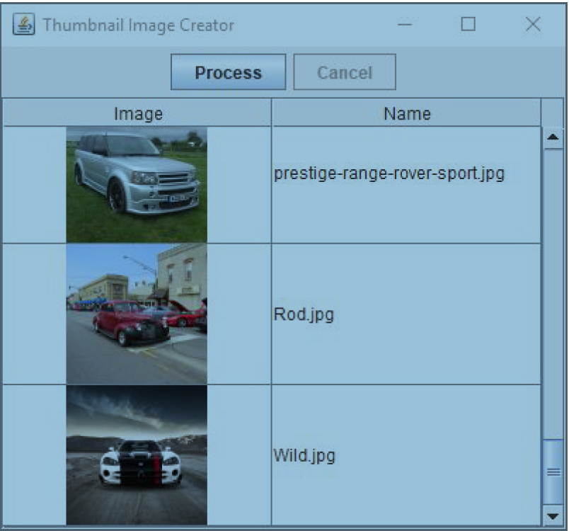

# A Thumbnail Generator

ThumbnailGeneratorApp is a Swing application that generates thumbnails from full size images. In response to pressing the Process button, the application allows the user to select a directory that should contain images with a .jpg extension. After selecting the directory, the application generates a thumbnail for each image and stores them in a subdirectory named thumbnails. The app should also populate a table showing each thumbnail it has generated.

Currently, the program correctly performs the thumbnail generation – you can go ahead and run it from within IntelliJ to see what it does, and you may use the supplied pictures folder containing car images for testing purposes. However, for large image files in particular, the processing can be expensive and `ThumbnailGeneratorApp` handles all image processing on the Event Dispatch thread. This means the UI is completely unresponsive while processing - the user's only feedback is a "success" message displayed at the end. Furthermore, while the generated thumbnails are added to a ThumbnailList object, the contents of this list is not displayed in the `JTable` .

Your tasks for this exercise are to modify the program so that the image processing is done in a background thread, and the `JTable` is appropriately updated.

Begin by thoroughly reading through and understanding the code - particularly that within the `ThumbnailGeneratorApp` class and classes within the model package - then proceed with parts A and B of this question.

---

### Part A - JTable Display

By examining the code, you'll see that each time a `Thumbnail` is created, it will be added to a `ThumbnailList` object. This object follows the observer pattern, and is capable of notifiying its observers - instances of `ThumbnailListener` - whenever items are added or removed from it.

You'll also notice that the `JTable`'s model is set to an instance of `ThumbnailTableModelAdapter`, and provided with the `ThumbnailList`. However, the adapter class is largely unimplemented. For part A, you'll complete this class by performing the following tasks:

---

1. Allow the `JTable` to display the information in a `ThumbnailList` by completing the implementation of the `getValueAt()`, `getRowCount()`, and `getColumnCount()` methods in the adapter class. You'll also need to store a reference to the `ThumbnailList` object that's provided in the constructor.

---

2. Allow the `ThumbnailList` to notify the adapter class whenever it changes. This can be done by having the adapter implement an appropriate interface, and by having it register itself as a listener on the `ThumbnailList`.

---

3. Whenever the `ThumbnailList` does change, the adapter needs to notify the `JTable` that its data has changed. To do this, make appropriate use of the `fire...()` methods.

---

### Part B - SwingWorker

Once part A is complete, the generated thumbnails will be displayed in the table. However, the app is still unresponsive, and the thumbnails are only displayed once all processing is complete. Your task is to modify the program so that it more appropriately uses a SwingWorker to handle image processing.

Specifically, modify `ThumbnailGeneratorApp` such that it meets the following requirements:

---

1. All image loading, thumbnail generation and saving must be performed in the background. Code in lines 100 to 113 should execute on a background thread, while code in lines 115 to 124 should execute on the event dispatch thread once processing is complete. These areas are marked with TODO statements.

---

2. Whenever an individual thumbnail has been generated, the GUI should report (as an intermediate result) that that thumbnail has been generated. Your background thread should `publish()` individual thumbnails to the Event Dispatch thread, where they can be `process()`'d.

---

3. By clicking on the Cancel button, the user must be able to abort the processing. Use SwingWorker's cancellation mechanisms for this purpose. If the operation is cancelled, a dialog box should be displayed to the user informing them of this.

---

### Marking Guide

| Subject                                                                                 | Mark |
|-----------------------------------------------------------------------------------------| ------ |
| Adapter correctly allows JTable to display thumbnails                                   | 4 marks |
| Adapter correctly listens to changes in ThumbnailList                                   | 2 marks |
| Adapter correctly fires table-changed events to notify the JTable it  should update     | 2 marks |
| Nested SwingWorker class definition                                                     | 3 marks |
| Appropriately starts SwingWorker running                                                | 2 marks |
| Necessary code moved into various SwingWorker methods                                   | 3 marks |
| No incorrect code moved into SwingWorker methods                                        | 2 marks |
| Intermediate results handled correctly                                                  | 3 marks |
| SwingWorker can be cancelled                                                            | 2 marks |
| GUI "niceties" (enabling & disabling buttons, displaying alternative mouse cursor, etc) | 2 marks |
