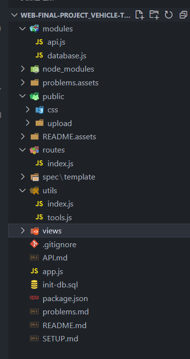

# 1.  API 接口文档

## 1.1. API V1 接口说明

- 接口基准地址：`http://127.0.0.1:3000/api/private/v1/`
- API V1 认证统一使用 Token 认证
- 需要授权的 API ，必须在请求头中使用 `Authorization` 字段提供 `token` 令牌
- 数据返回格式统一使用 JSON

### 1.1.1. 支持的请求方法

- GET（SELECT）：从服务器取出资源（一项或多项）。
- POST（CREATE）：在服务器新建一个资源。

### 1.1.2. 通用返回状态说明

| *状态码* | *含义*    | *说明*           |
| -------- | --------- | ---------------- |
| 200      | OK        | 请求成功         |
| 404      | NOT FOUND | 请求的资源不存在 |

------

### 1.1.3. 项目文件目录介绍



module/api.js     写sql语句来操作数据并导出

module/database.js    写mariadb链接sql的基本配置，并导出database

public       公开文件夹

upload   存放上传上来的车辆图片

routes   存放路由配置

utils/index.js     工具文件，存放生成与检测token的函数

utils/tools      工具文件，存放汽车图片上传的multer配置

views   存放handlebars的渲染页面

app.js主页面，中间件检测请求头是否携带了token

init-db.sql     初始化数据库的sql文件

## 1.2. 登录注册

### 1.2.1. 登录接口

- 请求路径：login
- 请求方法：post
- 请求参数

| 参数名   | 参数说明 | 备注     |
| -------- | -------- | -------- |
| username | 用户名   | 不能为空 |
| password | 密码     | 不能为空 |

- 响应参数

| 参数名     | 参数说明 | 备注            |
| ---------- | -------- | --------------- |
| rel_name   | 真实姓名 |                 |
| password   | 密码     |                 |
| username   | 用户名   |                 |
| born_data  | 出生日期 |                 |
| class_name | 类名     |                 |
| token      | 令牌     | 基于 jwt 的令牌 |

- 响应数据

```json
{
  username: 'root',
  password: 'root',
  rel_name: 'HHH',
  born_date: '22222222',
  class_name: 'A'
}
```


### 1.2.2. 注册接口

- 请求路径：resister
- 请求方法：post
- 请求参数

| 参数名     | 参数说明 | 备注     |
| ---------- | -------- | -------- |
| username   | 用户名   | 不能为空 |
| password   | 密码     | 不能为空 |
| rel_name   | 真实名字 |          |
| start_date | 出生日期 |          |
| class_name | 类名     |          |

- 响应数据

```json
{
  "meta": {
        "status": 200
    }
}
```


### 1.2.3. 管理员注册接口

- 请求路径：adminLogin
- 请求方法：post
- 请求参数

| 参数名     | 参数说明 | 备注     |
| ---------- | -------- | -------- |
| username   | 用户名   | 不能为空 |
| password   | 密码     | 不能为空 |
| rel_name   |          | 真实姓名 |
| born_data  | 出生日期 |          |
| class_name |          | 类名     |

- 响应数据

```json
{
  "meta": {
        "status": 200
    }
}
```


## 1.3. 用户管理

### 1.3.1. 用户信息查看

- 请求路径：user_msg
- 请求方法：get
- 请求参数

| 参数名   | 参数说明 | 备注     |
| -------- | -------- | -------- |
| username | 用户名   | 可以为空 |
| password | 密码     |          |

- 响应数据

```json
{
  username: 'root',
  password: 'root',
  rel_name: 'HHH',
  born_date: '22222222',
  class_name: 'A'
}
```

### 1.3.2. 用户信息修改

- 请求路径：user_msg_edit
- 请求方法：post
- 请求参数

| 参数名     | 参数说明 | 备注     |
| ---------- | -------- | -------- |
| username   | 用户名   | 不能为空 |
| password   | 密码     | 不能为空 |
| rel_name   | 真实名字 |          |
| born_data  | 出生日期 |          |
| class_name | 类名     |          |

- 响应数据

```json
{
  "meta": {
    "status": 200
  }
}
```

### 1.3.3. 用户信息查看

- 请求路径：user_msg
- 请求方法：get
- 请求参数

| 参数名 | 参数说明 | 备注                |
| ------ | -------- | ------------------- |
| 无     |          | 可以解析token来获取 |

- 响应数据

```json
{
  username: 'root',
  password: 'root',
  rel_name: 'HHH',
  born_date: '22222222',
  class_name: 'A'
}
```

## 1.4. 管理员操作

### 1.4.1. 新建车辆

- 请求路径：create_che
- 请求方法：post

- 请求参数

| 参数名          | 参数说明     | 备注 |
| --------------- | ------------ | ---- |
| register_number | 车牌号       |      |
| maker           | 制造商       |      |
| model           | 型号         |      |
| year            | 车型年       |      |
| start_value     | 起始里程值   |      |
| color           | 颜色         |      |
| nums            | 座位数       |      |
| filename        | 图片存放路径 |      |

- 响应数据

```json
  {
    "meta": {
        "status": 200
    }
}
```

### 1.4.2. 车辆删除页面

- 请求路径：delete_che
- 请求方法：get
- 响应数据

```json
{
    {
    register_number: 'A',
    maker: 'A',
    model: 'A',
    year: 1111,
    start_value: 1,
    color: '1',
    nums: 1,
    picture_path: '1644573151128.jpg'
  },
  {
    register_number: 'AAA',
    maker: 'BBB',
    model: 'CCC`',
    year: 222,
    start_value: 222,
    color: '222',
    nums: 2,
    picture_path: '1644573209748.jpg'
  }
}
```

### 1.4.3. 删除车辆

- 请求路径：delete_che
- 请求方法：post

- 请求参数

| 参数名          | 参数说明 | 备注 |
| --------------- | -------- | ---- |
| register_number | 车牌号   |      |

- 响应数据

```json
 {
    "meta": {
        "status": 200
    }
}
```

### 1.4.4. 车辆编辑页面

- 请求路径：edit_che
- 请求方法：get
- 响应数据

```json
{
    {
    register_number: 'A',
    maker: 'A',
    model: 'A',
    year: 1111,
    start_value: 1,
    color: '1',
    nums: 1,
    picture_path: '1644573151128.jpg'
  },
  {
    register_number: 'AAA',
    maker: 'BBB',
    model: 'CCC`',
    year: 222,
    start_value: 222,
    color: '222',
    nums: 2,
    picture_path: '1644573209748.jpg'
  }
}
```

### 1.4.5. 编辑车辆

- 请求路径：edit_che
- 请求方法：post

- 请求参数

| 参数名          | 参数说明     | 备注 |
| --------------- | ------------ | ---- |
| register_number | 车牌号       |      |
| maker           | 制造商       |      |
| model           | 型号         |      |
| year            | 车型年       |      |
| start_value     | 起始里程值   |      |
| color           | 颜色         |      |
| nums            | 座位数       |      |
| filename        | 图片存放路径 |      |

- 响应数据

```json
 {
    "meta": {
        "status": 200
    }
}
```

### 


## 1.5. 预定管理

### 1.5.1. 车辆对应是否可预订用户页面

- 请求路径：cars_book_user

- 请求方法：get

- 响应数据，用用于渲染cars_book_user页面

```json
{
    register_number: 'A',
    maker: 'A',
    model: 'A',
    year: 1111,
    start_value: 1,
    color: '1',
    nums: 1,
    picture_path: '1644573151128.jpg',
    user_data: [ [Object], [Object], [Object], [Object], meta: [Array] ]
  },
  {
    register_number: 'AAA',
    maker: 'BBB',
    model: 'CCC`',
    year: 222,
    start_value: 222,
    color: '222',
    nums: 2,
    picture_path: '1644573209748.jpg',
    user_data: [ [Object], [Object], [Object], [Object], meta: [Array] ]
  }
}
```

### 1.5.2. 管理添加车辆与用户的可预约关系

- 请求路径：add_book
- 请求方法：get
- 请求参数

| 参数名          | 参数说明 | 备注        |
| --------------- | -------- | ----------- |
| username        | 用户名   | 不能为空    |
| register_number | 车牌号   | 不·可以为空 |

- 响应数据

```json
{
    "meta": {
        "msg": "创建成功",
        "status": 201
    }
}
```

### 1.5.3. 管理员删除车辆与用户的可预约关系

- 请求路径：delete_book
- 请求方法：get
- 请求参数

| 参数名          | 参数说明 | 备注        |
| --------------- | -------- | ----------- |
| username        | 用户名   | 不能为空    |
| register_number | 车牌号   | 不·可以为空 |

- 响应数据

```json
{
    "meta": {
        "msg": "删除成功",
        "status": 201
    }
}
```

### 1.5.4. 查看所有可以预定的车辆

- 请求路径：see_can_book
- 请求方法：get
- 请求参数

| 参数名 | 参数说明                                  | 备注 |
| ------ | ----------------------------------------- | ---- |
| 无     | 通过token解析出username于password当做参数 |      |

- 响应数据

```json
{
    register_number: 'A',
    maker: 'A',
    model: 'A',
    year: 1111,
    start_value: 1,
    color: '1',
    nums: 1,
    picture_path: '1644573151128.jpg'
  },
  {
    register_number: 'AAA',
    maker: 'BBB',
    model: 'CCC`',
    year: 222,
    start_value: 222,
    color: '222',
    nums: 2,
    picture_path: '1644573209748.jpg'
  }
}
```

### 1.5.5. 根据车牌号查车辆信息

- 请求路径：data_car
- 请求方法：get
- 请求参数

| 参数名          | 参数说明 | 备注     |
| --------------- | -------- | -------- |
| register_number | 车牌号   | 不能为空 |

- 响应数据

```json
{
    register_number: 'AAA',
    maker: 'BBB',
    model: 'CCC`',
    year: 222,
    start_value: 222,
    color: '222',
    nums: 2,
    picture_path: '1644573209748.jpg'
 }
```

### 1.5.6. 车辆预定

- 请求路径：yuding_msg
- 请求方法：post
- 请求参数：

| 参数名          | 参数说明 | 备注 |
| --------------- | -------- | ---- |
| start_time      | 开始时间 |      |
| rids            | 结束时间 |      |
| register_number | 车牌号   |      |
| distance        | 距离     |      |
| username        | 用户名   |      |
| money           | 金钱消耗 |      |

- 响应数据

```json
{
    "meta": {
        "msg": "预定成功",
        "status": 200
    }
}
```

### 1.5.7. 我的所有预定

- 请求路径：my_book

- 请求方法：get

- 请求参数

  | 参数名 | 参数说明                        | 备注 |
  | ------ | ------------------------------- | ---- |
  | 无     | 通过token解析出用户名来获取数据 |      |

- 响应数据

  ```json
  {
     {
      id: 86887171,
      start_time: 111,
      end_time: 111,
      register_number: 'A',
      distance: '4',
      username: 'root',
      money: 8
    }
      "meta": {
          "msg": "获取预定数据成功",
          "status": 200
      }
  }
  ```

### 1.5.7. 根据id删除预定信息

- 请求路径：delete_yuding

- 请求方法：get

- 请求参数

  | 参数名 | 参数说明           | 备注 |
  | ------ | ------------------ | ---- |
  | id     | 数据在数据库里的id |      |

- 响应数据

  ```json
  {
      "meta": {
          "msg": "删除预定信息成功",
          "status": 200
      }
  }
  ```
