# Final Project - Web

Begin by forking this repository into your lab exercises namespace by clicking the ```fork``` button.


Select your lab exercises namespace as the fork destination on the resulting window.

Once forked, clone the repository to your computer by following the instructions for your editor.

This is an individual assignment, and must be completed without assistance from other students or external persons. You are welcome to use online resources without other limitations.

Your completed code must be pushed to Gitlab at or before the 0900 NZDT on the 14th of February 2022. Late submissions will not be considered without prior arrangement.

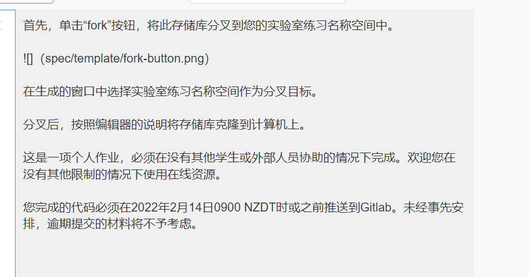


# Overview

In this project you will develop a vehicle data tracking system using the skills you have learnt through the _Programming with Web Technology_ course. The project will also give you the opportunity to show how you can use online resources to discover and apply content not taught within the course.

The system will support user registration and authentication, permissions management, and a range of Create-Read-Update-Destroy (CRUD) operations. A complete list of requirements is found below.

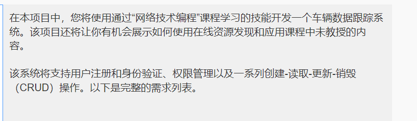

## Project Brief

A company has a number of vehicles that employees are able to make use of for various work related tasks. The company operates in many domains, and has accumulated a wide variety of vehicles suitable for different uses. As the company has grown it has become harder to track if vehicles are available to be used at given times, and employees are regularly not recording the mileage and expenses accumulated for the vehicle they are using. With such a large selection of vehicles available, it has also been seen that employees are not aware of what options they have available to them, and are using vehicles not suited to the task they are engaging in. Some departments within the company have asked that certain vehicles be allocated only to their staff, as these vehicles have features necessary for them to perform their duties, and there have been multiple occasions where these vehicles have been taken by others.

To address this, a web application is to be developed that manages the fleet of company vehicles, giving a single location for tracking vehicle bookings, mileage, and expenses; and providing a method for users to identify suitable vehicles to make use of, while ensuring that some vehicles are only usable by named staff. This application should support creation of user accounts, tracking the users personal details and department, and allow users to log in and create bookings for vehicles. For each booking, the user should be prompted to enter mileage information, tracking how far they drove, and expense information for refuelling and any maintenance performed during that booking period. Users should be restricted to making bookings only on vehicles they have permissions to use, and only at times when no other booking exists. Users should also be able to modify and delete their own bookings, while being allowed to view the bookings of other users.

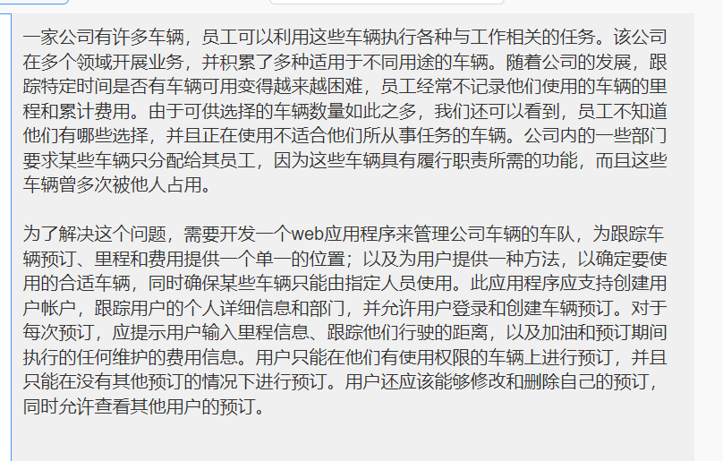

The administrator of this system should be able to add and remove vehicles, and manage permissions for individual users. They have further requested that an API be made available that allows bookings, mileage, and expenses to be managed from an external application. To ensure a high level of security, they have asked that API tokens be used for authentication rather than a username and password, and that each user be able to generate a token themselves without assistance from the administrators. 

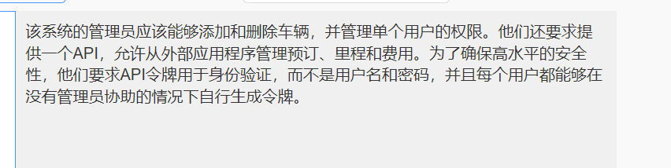

## Marking Criteria

This project is worth 20% of your final grade for the _Programming with Web Technology_ course. The project grade is weighted based on the following categories.


| Category                             | Grade    |
|--------------------------------------|----------|
| API feature implementation           | 20%      |
| Web interface feature implementation | 40% |
| API documentation                    | 10% |
| Code quality                         | 10% |
| Daily meetings                       | 10% |
| Version control usage                | 10% |

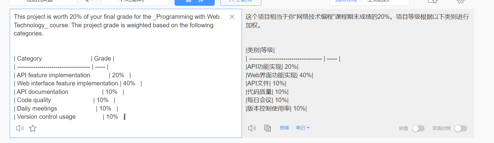

### API feature implementation (20%)

In the **API Requirements** section below, a list of required API features is detailed. This grade will be determined by the overall completion of required features, and the functionality of each of these features. Not every feature is weighted equally, extension features are marked as such and contribute less to your grade than those not marked. This gives you the opportunity to extend yourself and obtain higher grades as a reward, but does not unduly penalise you if you are unable to complete them.

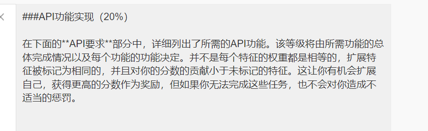

### Web interface feature implementation (40%)

In the **Web Interface Requirements** section below, a list of features for the web interface are shown. This grade will be determined by the overall completion of required features, and the functionality of each of these features. Not every feature is weighted equally, extension features are marked as such and contribute less to your grade than those not marked. This gives you the opportunity to extend yourself and obtain higher grades as a reward, but does not unduly penalise you if you are unable to complete them.

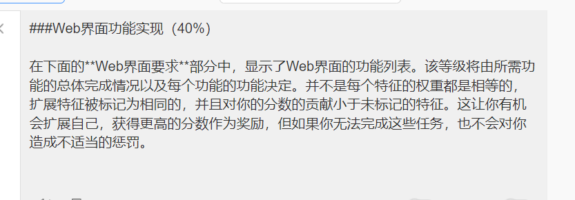

### API documentation (10%)

The API created is intended to be a simulacrum of an API that would be consumed by third parties, and as such should be documented. This documentation should be easily accessible through your web interface, and should cover all API endpoints that you make accessible. Full requirements are detailed in the **API Documentation** section below.

Grades will be determined through evaluating the documentation coverage for your API, the clarity of the document, and the relevance of examples provided.

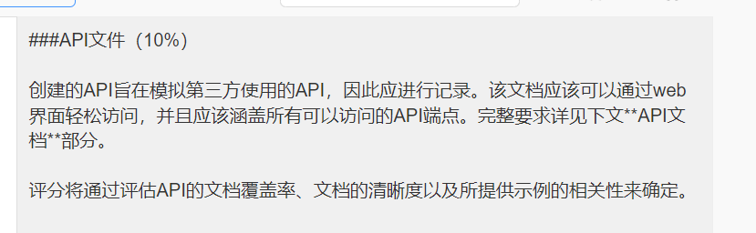

### Code Quality (10%)

Your code must be easily understandable by third parties, and conform to best practices. This includes the use of appropriate variable and identifier names, sufficient commenting, and breaking your code up into appropriate modules, amongst other considerations. It should be written in a way that would make it easy for other people to understand and modify.

You should use code organisation and quality techniques covered in the course content where possible and appropriate. This would include use of modular routing, design patterns, refactoring, and testing where possible.

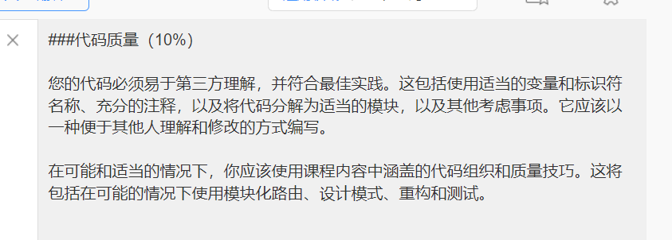

### Daily meetings (10%)

Each working weekday during the project, you are required to briefly meet in-person or via a voice chat with your lecturer to report progress, and to discuss any issues you have encountered that may require assistance. These meeting may also serve as a opportunity to get feedback on design decisions you have made.

Grades are allocated based on attendance for these meetings, with full marks obtained by attending on each required day. Meeting days will be 1-4, and 8-11 February, though may be subject to change.

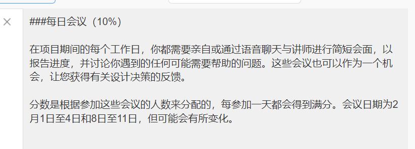

### Version control usage (10%)

When working on large projects, use of version control is very important to ensure that work can be undone and recovered to restore functionality in the event that errors were made in development. Usage of git is expected, and regular committing with relevant commit messages will be evaluated. Grade will be determined through evaluation of the project commit log.

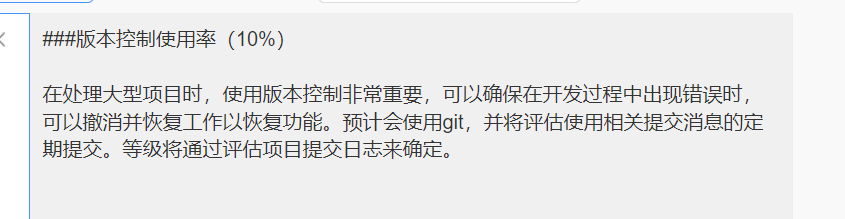

# Requirements

This project has three major requirement categories, broken into API, Web Interface, and API Documentation requirements.

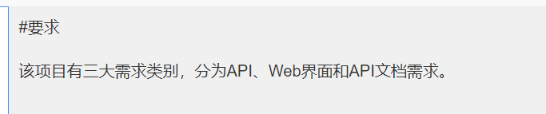


## Web Interface Requirements

To form the core functionality of this application, the following requirements need to be met.


### General

1. Database connection details should be stored in an external configuration/`.env` file, and should not be included in the repository. Ensure a `.env.sample` file is present to indicate what values need to be supplied.
2. Make use of prepared statements when dealing with user-provided data,
2. 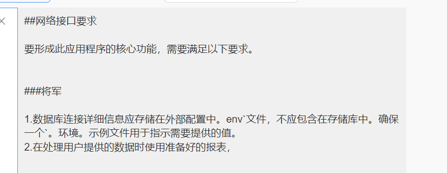


### User accounts

1. A user account with the username "Administrator" **must** exist. If the application finds that it does not exist, or that it does not have an associated password, it should assume this is the first time the application is being run. In this event, the application should present a full-screen prompt for a new password, which it should record against the "Administrator" user. This should occur regardless of what page was accessed.
   1. (**Extension**) Extend this "first run" behaviour to support creating the database schema if the necessary tables are not present on the specified database.
2. When not logged in, users should be directed to a "Sign Up / Log In" page, and should be unable to go to any page until logged in.
   + (**Extension**) Redirect the user to their requested page after successfully logging in.

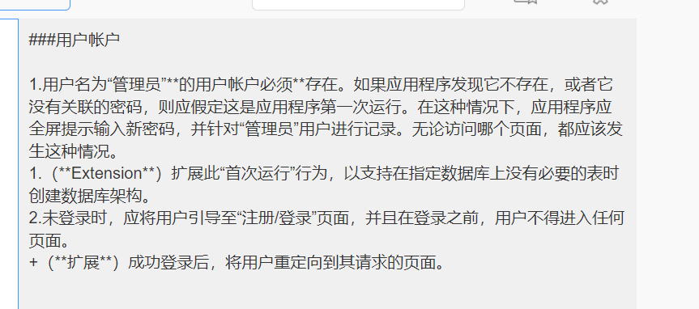

1. Users must be able to create new accounts. Each new user should be able to choose a username (which must be unique) and a password. The user's real name and date of birth should be recorded, along with the name of the department they belong to.
2. When selecting a username while creating an account, the user should be immediately informed if the given username is already taken. The user should not have to submit a form to discover whether their chosen username is taken.
3. When selecting a password while creating an account, users should be presented with two password textboxes (e.g. "Choose password", and "re-enter password"). They must type the same password in each box in order to proceed. If the user didn't enter the same password in both textboxes, they should not be allowed to submit the form. Ideally, a visual notification message, such as ("passwords do not match"), should also be displayed.
4. Users' passwords should not be stored in plaintext - they should be appropriately hashed and salted. You will need to research hashing and salting; we can provide some materials that will help with this if required.
5. Once a user has created an account, they must be able to log in and log out.
6. Users must be able to view and edit any of their account information - **including** their username - from an account management page.
7. Users should be able to view, delete, or regenerate an API token for their account. See **API Requirements**.
10. Users should be able to view the details of any other user.

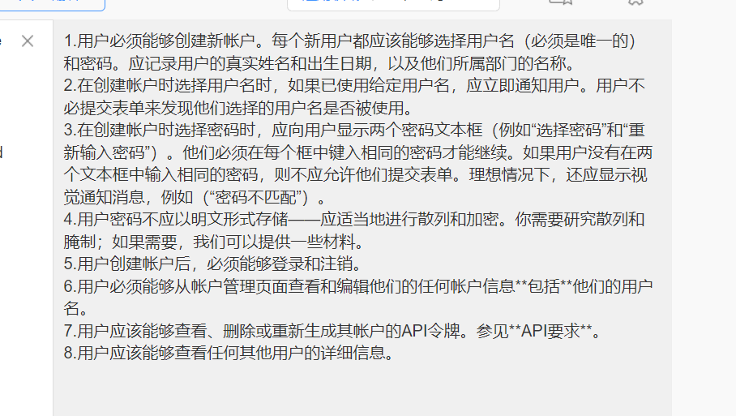


### Vehicles

1. **The "Administrator" user** should be able to create, edit, and delete vehicle entries. Vehicle entries should include:
    + A unique 6 character alpha-numeric registration number, using the characters A-Z, and digits 0-9.
    + A manufacturer name (e.g., "Ford")
    + A model name (e.g., "Raptor")
    + A model year (e.g., 2015)
    + A starting mileage value (The number of miles/kilometers the vehicle had driven before it was owned by the company)
    + A vehicle colour (e.g., "White")
    + The number of seats the vehicle has (e.g., 5)
    + A photo of the vehicle
    + 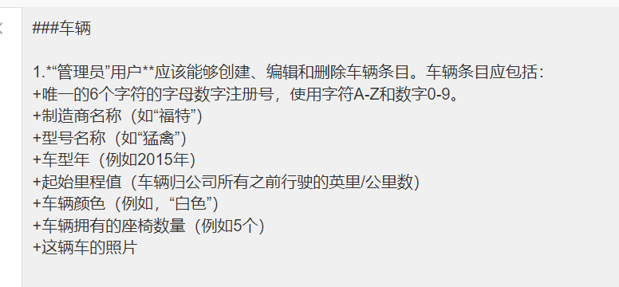
    
2. **The "Administrator" user** should be able to manage an "allow list" for each vehicle, that indicates which users may make bookings for that vehicle. Users should be presented in a list, with a checkbox that determines if they have permissions to book this vehicle or not.
   
   + (**Extension**) allow for toggling between an "allow" and "block" list view. In the "allow list", a checkmark next to a user indicates they can book the vehicle, and no mark means they cannot. In the "block list" view, a checkmark means the user _cannot_ book the vehicle, while no mark means they may.
   
3. Users should be able to see a list of all vehicles that they may make bookings for. 

4. Users should be able to sort and filter their list of vehicles based on the number of seats the vehicle has. This should not require the page to be reloaded.
   + (**Extension**) Allow the sort and filter values to persist between page reloads, retaining the sort and filter values until they are changed again.
   + 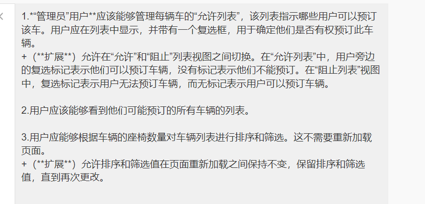
   
5. Users should be able to view the details of a vehicle they have permissions to make bookings for, viewing the details provided by the Administrator.
   1. (**Extension**) Add to these details to show the **current** mileage for the vehicle
   
   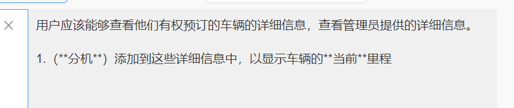


### Bookings

1. Users should be able to view a list of bookings for a vehicle. These should be presented in a time-ordered fashion.

2. Users should be able to create a new booking for a vehicle, recording the start and end time of the booking rounded to the hour (i.e., Bookings will always be multiples of one hour long), and an optional description for the booking.
   + (**Extension**) Bookings should only be allowed if they do not interfere with existing bookings, preventing overlapping of bookings.
   
3. Users should be able to edit and delete their own bookings. 
   + (**Extension**) Editing and deleting of bookings should only be possible if no mileage or expense records have been associated with the booking.
   + (**Extension**) Enforce the above behaviour by only showing the options for these actions when it is permissable.
   + (**Extension**) Validate the start and end time of the booking if it is edited to ensure it is still valid. If it overlapped with another booking, the edit should be rejected.
   
   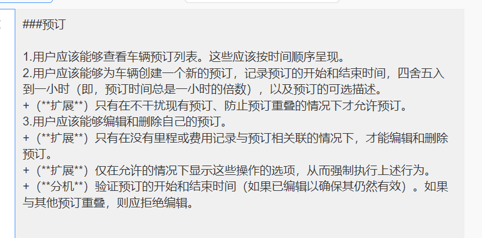


### Vehicle Records

1. Users can add mileage records to their own bookings, recording the distance driven, the start time of the trip, and the end time of the trip. Each booking may have many mileage records.
2. Expenses can be recorded against bookings owned by the user. These should record the value of the expense, and details of the expense. Each booking may have zero or more expense records.
3. Users can modify and delete mileage and expense records for their bookings.


### Usability

1. The website must have a consistent look and feel, and must be responsive.
2. The website must be user friendly. When adding the features, consider how such features have been implemented in other websites you've used before. What did you like about those websites? What could use improvement?

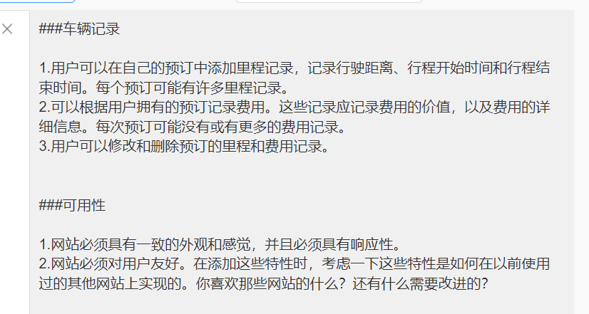


## API Requirements

To support external applications, an API needs to be developed that supports creation, reading, updating, and deleting of vehicle bookings, mileage records, and expenses for individual users. To accomplish this, the following requirements need to be met.

1. Add support for an API token to be used for authentication. When communicating with the API, a token should be provided by the external party application which is matched internally to a user record. These tokens should be generated by the web application at the request of users, and should be associated with the user that created them. Each user can have 0 or 1 API tokens at once.
    + When a request is made to the API without a valid token, a 401 error should be returned.
    + If a request with a valid token is received, but the action would require creating/modifying/deleting an entry associated to a user other than the one the token is associated with, a 403 error should be returned.
    + If a request with a valid token is received and the action would create/modify/delete an entry associated with the user the token is associated with, a 200 status should be returned, along with any requested data.

    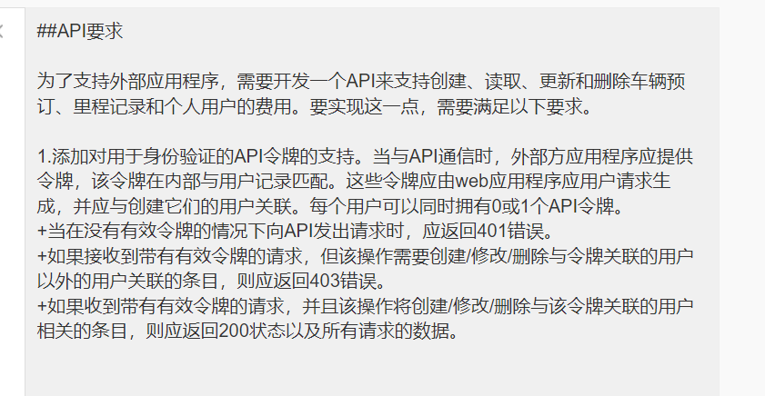
    
2. Create appropriate API endpoints that provides the requester with information on vehicles they have permission to make bookings for. This should support providing a list of all vehicles they have access to, and complete details about specific vehicles. This should be a **read-only** endpoint.
   + (**Extension**) Provide ability to restrict results based on vehicle attributes. Not all attributes need be supported.

3. Create appropriate API endpoints that allows the requester to view and manage bookings for a specified vehicle. The requester should be able to view all bookings for the vehicle, and to create new bookings. The requester can choose to edit or delete their own bookings.
    + (**Extension**) Provide ability to restrict results based on time range, allowing selection of records before or after a date, or between two dates.
    + (**Extension**) Provide ability to display only bookings owned by the requester. Further, add the ability to show only bookings that have no mileage or expense records associated with them.

    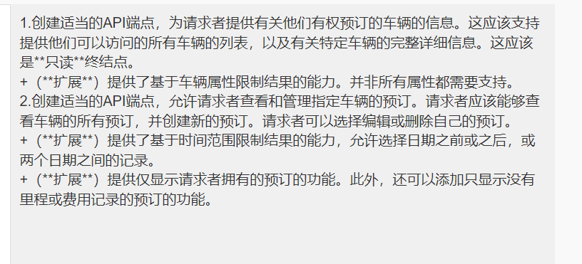
    
4. Create appropriate API endpoints that allows the requester to view mileage and expense records associated with a booking. The requester should be able to add new records to their own bookings, but not to those belonging to others. The requester can choose to edit or delete their own records.

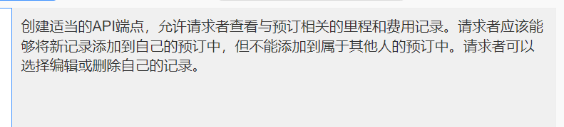

## API Documentation Requirements

To support 3rd party application development, the created API requires documentation. This documentation should satisfy the following requirements.

1. Provide a documentation entry for each API endpoint, documenting the supported methods (GET/POST/etc...), required data and parameters, possible status codes, and the format of values returned. Entries should be grouped with related entries.
2. Detail how an API token can be created for a user, providing a direct link to the location where this can be accomplished.
3. Present a simple usage example with each endpoint, showing an example of a valid and invalid request, and data that may be returned in each case. The data can be placeholder data, it does not need to reflect data stored within the application.
4. Ensure that this documentation is easily accessible from within the web application.

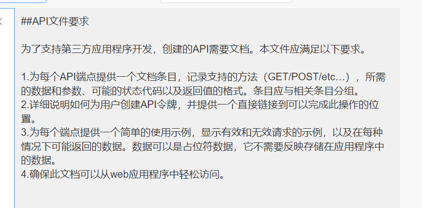


# Deliverables & Project Submission

## Source Code
Your git repository will serve as the submission for your project source code. Ensure that your repository master branch is up-to-date on or before the due date given at the top of this document. Any commits after this deadline will be ignored by the markers.

Ensure that the provided [`db-init.sql`](./db-init.sql) file contains the necessary SQL statements to recreate and initialise your database manually if required.

If any special setup instructions are required, please document these in the provided [`SETUP.md`](./SETUP.md) file.

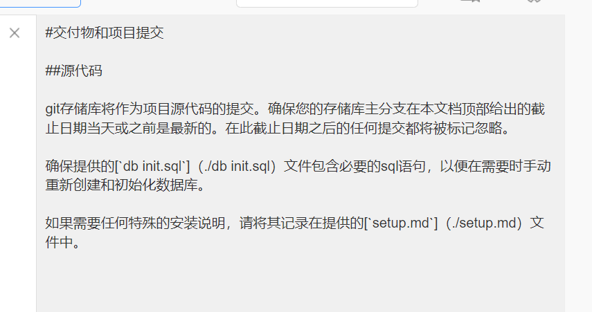
