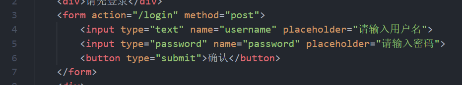

完成了数据库基本的设计，新建好了表，以及完成了基本的app.js的配置，完成modules文件里对数据库链接信息的基本配置。

数据库的设计问题：
比如要求里面提到的：表如何设计？有关用户可以看到所有允许预约的车辆，车辆

​										管理员可以指定哪些用户可以预订该车
技术问题：
​    车辆图片的上传问题？是直接图片传到本地存储，然后路径存在数据库里吗？

#### 问题：

这个报错是什么原因？

这样的form，设置的是post，为什么在提交的是否却是GET请求方式

