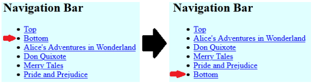

# Web Homework 2

Begin by forking this repository into your lab exercises namespace by clicking the ```fork``` button.


Select your lab exercises namespace as the fork destination on the resulting window.

Once forked, clone the repository to your computer by following the instructions for your editor.

This is an individual assignment, and must be completed without assistance from other students or external persons. You are welcome to use online resources without other limitations.

Commit and push your changes regularly. This is especially important with homework tasks, as the contents of changes, timestamps, and commit messages will be used in part to verify independence of solutions. Git usage may account for up to 50% of your grade.

Your completed code must be pushed to Gitlab at or before the 0900 NZDT on the 20th of December 2021. Late submissions will not be considered without prior arrangement.

---


## Question 1

In this task you will use JavaScript and CSS Grid to display the content included in the HTML and JavaScript files as shown in this screenshot.


Importantly, in this task, you will use JavaScript to display the staff details contained in the `staffDetails` array within the `task.js` JavaScript file. You will also use CSS Grid so that the 'About Us' section and staff details are contained in two separate columns.

You have been supplied with the basic HTML content and JavaScript content to get started but you will have to write much of your own JavaScript, HTML and CSS.

Tasks:

1. Create the necessary CSS code to create a CSS Grid that will display the content as per the image above. The header should spread the width of the page, the `left` and `right` column divs that display content below the header should be spaced similarly to the image above: the left and right divs should be three and two fifths respectively. There should also be blank space on the left and right of the content as shown in the image above; this should also be created with CSS Grid. Add other CSS code as required so that the content displays similar to the image above. Note that the content of the right div will be created by JavaScript in the next step.
2. Create then necessary JavaScript code to display the content from the `staffDetails` JavaScript array within the right div as shown in the image above. This should loop through all JavaScript objects in the `staffDetails` array. The name of the staff member and `Interests:` should be `h3` elements. The birth year and country should be displayed with an unordered list and the interests should be displayed with an ordered list. Because interests is a nested array of unknown size you will need to use a nested loop (a loop within a loop) or similar to display the content.
3. Add the necessary CSS so that when the page is less than 500 pixels in width the left and right divs will become a single column with the left div displayed first at the top and the right div displayed below it. The best way to achieve this is with an appropriate media query that contains the CSS grid code that relates to screens less that 600 pixels in width.
3. 

---

## Question 2

In this question you will use JavaScript to generate an interactive page using data from a JSON structure. You will use event-driven programming to load this content, show additional information, and to remove items from the page. All of your work will happen in the `question02.js` file. You are not to change any other files.

The JSON document containing the page information has been created and made available to you through the `INPUT_JSON` variable. Answering the questions below will require you to look at the structure of this data so that you can get information out of it. The definition for this can be found in the `input_json.js` file within the project.

*NOTE*: In documentation comments throughout the provided JavaScript you will see entries that contain elements you have not seen before. Examples might look like:


```
@param {HTMLDivElement} ...
```
or
```
@type {({date: string, comments: ...})[]}
```
The parts in the braces are type hints that will allow IntelliJ to give you better auto-completion and warnings. You do not need to pay any attention to these yourself.


### Part 1 - Loading Articles

In the bottom of the `question02.js` file, create an event handler that will trigger when the page has finished loading. In this event handler, iterate over the `INPUT_JSON` array and with each item, create a new article element using the `createArticleElement` function provided. Once created, append these elements to the page, again using the provided `insertArticle` function. When complete, your page should look like the following screenshot.


### Part 2 - Adding Navigation

Modify your code from step 1, so that when each article is generated, a navigation entry is also created and inserted into the navigation bar. Again, there are functions already available to help with this.


### Part 3 - Navigation Bookmarks

Update the `createNavigationElement` function so that the `a` element it generates links to its corresponding article. That is to say, if the entry for Don Quixote is clicked in the navigation bar, the browser should scroll down to the Don Quixote article entry on the page. This will require you to also make changes to the `createArticleElement` function, and other code that calls these functions.

*HINT*: You may want to introduce a new argument to each of these functions that provides an `id` value to each.


### Part 4 - Positioning Navigation Entries

Modify the `insertNavigation` function so that the navigation entries for articles are placed between the **Top** and **Bottom** items.





### Part 5 - Completing the articles

Update the `createArticleElement` function so that it can display the article title, author, publication date, tags, body, and a 'Click here to load comments' item as shown in the screenshot below.


The HTML structure you are trying to generate here should look as follows:


```
- div
  - h1 Title
  - h2 Author
  - h3 Publication date
  - div Tags
    - span Tag
    - ...
  - div Body
    - p Body paragraph
    - ...
  - hr
  - div Comments
    - ...
```


### Part 6 - Showing Comments

Update your code so that when an article's **Click here to load comments** element is clicked, the text is replaced with comment elements containing comments for that article.

*HINT*: you want to introduce this code in your `createArticleElement` function.


### Part 7 - Removing Tags

Article tags generated by the `createTagElement` function contain a cross icon, which is represented in a `span > i` structure.

Add code to the `createTagElement` function that waits for this cross to be clicked, and then removes the whole tag element from the page. The following illustrates the before/after states when the cross is clicked on the art tag.

*NOTE*: You will not be able to add a listener to the `i` element, as the listener will be cleared when the `i` is replaced with the icon.


