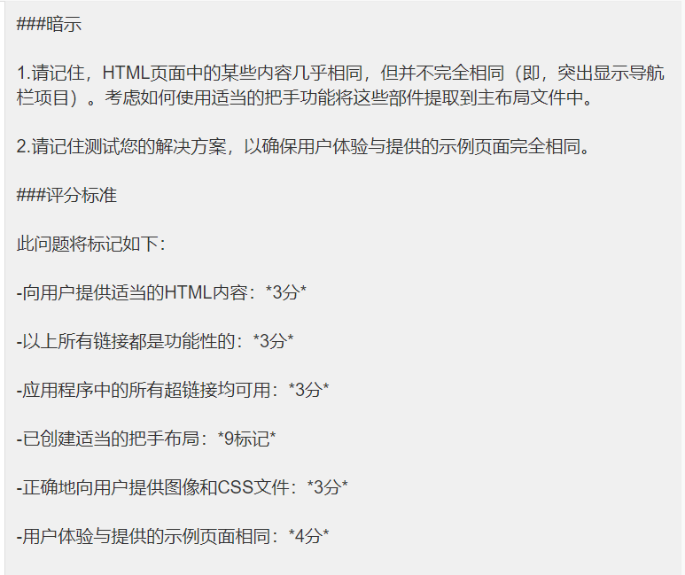

# Web Homework 3

Begin by forking this repository into your lab exercises namespace by clicking the ```fork``` button.


Select your lab exercises namespace as the fork destination on the resulting window.

Once forked, clone the repository to your computer by following the instructions for your editor.

This is an individual assignment, and must be completed without assistance from other students or external persons. You are welcome to use online resources without other limitations.

Commit and push your changes regularly. This is especially important with homework tasks, as the contents of changes, timestamps, and commit messages will be used in part to verify independence of solutions. Git usage may account for up to 50% of your grade.

Your completed code must be pushed to Gitlab at or before the 0900 NZDT on the 17th of January 2022. Late submissions will not be considered without prior arrangement.

---

## Notes


- There are **two questions** in this homework task. Attempt **both** questions.
- Each question is worth 25 marks.
- **Remember**: You're given `package.json` files which contain all necessary dependencies, but will need to recreate the `node_modules` folders yourself by running the appropriate command.
- **Important**: Make sure to read the instructions and provided source code carefully before attempting each question.


---

## Question One: Removing duplication with Handlebars

Inside the `question-one/__reference_site` foler, you'll see a set of static webpages with associated CSS and image content. Open any of the files and browse through the pages using the navbar – you'll see that the content is very similar to that which you've written in early labs for this course.

Now, open the HTML files in a text editor and compare them. You'll notice that a lot of the information in the pages is the same (for example, each page has the same JavaScript / CSS links and a very similar navbar).

For this question, add **one Handlebars layout** and **three Handlebars views** (one for each of the two famous New Zealanders, and one for the "home" page) found within the views folder. The layout should contain as much of the structure as possible, that's currently duplicated amongst the provided HTML files, and should be called `question-one-layout.handlebars`. The views should contain the content that's specific to each page. Place the views and layout in the appropriate folders within the main skeleton project you've been given.

Once you've done that, modify `routes/question-one-routes.js` to include three route handlers:

1. Navigating to <http://localhost:3000/> should display the home page.

2. Navigating to <http://localhost:3000/hillary> should display the page on Edmund Hillary.

3. Navigating to <http://localhost:3000/sheppard> should display the page on Kate Sheppard.

You will also need a way to access the CSS and image files. Move these within the public folder appropriately and add code to `question-one.js` in the marked location which enables access to this public folder.

Once these URLs are live, make sure that the links within the website all point to the correct locations.


### Hints

1. Remember that some of the content in the HTML pages is nearly – but not exactly – identical (i.e. the highlighting of the navbar items). Consider how you can make use of appropriate Handlebars functionality to extract these parts into the main layout file.

2. Remember to test your solution to make sure the user experience is exactly the same as the provided sample pages.

### Marking criteria
This question will be marked as follows:

- Appropriate HTML content is served to users: *3 marks*
- All of the above links are functional: *3 marks*
- All hyperlinks within the app are functional: *3 marks*
- Appropriate Handlebars layout has been created: *9 marks*
- Images and CSS files are properly served to users: *3 marks*
- User experience is identical to the provided sample pages: *4 marks*




---


## Question Two: Saving form data in a cookie

In this task, we'll complete a simple "user registration" form. Users will be able to enter their details, and will be able to register, or come back later to complete the registration form.

The existing app will present users with a registration form when navigating to `/`. The form allows them to enter their name, address and phone number. The form is set to `POST` to `/submit` – but this submission process currently does not work.

To begin this question, complete the `/submit` route handler by performing the following steps:

1. You'll see an empty `detailsCookie` object defined within the handler. To this object, add three properties: `name`, `address`, and `phoneNum`. The data for these properties should come from the three `<input>`s on the submitted form.
2. Next, at the marked location, save the `detailsCookie` (using the `res.cookie()` function). The cookie should be named `details`.
3. At the marked location redirect the user based on their progress in filling out the form:

   - If the user has filled out all three form fields, redirect them to `/myDetails`.
- Otherwise, redirect them to `/`, with the message query param set to "Details saved for later" (see the `/` route handler and `question-two-form` view to see how this query parameter is used).


Next, we'll modify the `/` route handler and `question-two-form view` so that any partially-complete data is visible to the user when they load the page. Perform the following steps:

4. At the marked location within the `/` route handler, add the information in the "details" cookie to `res.locals`, so that it is available to the `question-two-form` view. Remember that `req.cookies.details` might be undefined, if the user hasn't submitted the form yet – be sure to account for this.

5. Looking at the `question-two-form` view, we can see that each `<input>` is defined with `value=""`. A text `<input>`'s value determines what will be displayed in the input when the page is first loaded. Set each input's value to the appropriate piece of information sent to the view from step 4 above.

Finally, we'll add the `/myDetails` route handler and complete the `question-two-details` view. Perform the following steps:

6. Add a new route handler, such that when the user makes a `GET` request to `/myDetails`, the contents of the `details` cookie are sent to the `question-two-details` view for rendering.
7. At the marked location within the `question-two-details` view, add a `<table>` which appropriately displays the values supplied in step 6 above. The table should have a nice look-and-feel. **Hint:** This website is styled using a CSS Framework called Bootstrap 4, which provides a number of predefined classes that can be applied to elements to modify the appearance. You should be able to browse the Bootstrap 4 documentation for tips on how to make a nice-looking table.


### Marking criteria

This question will be marked as follows:

- `detailsCookie` object populated correctly: *3 marks*
- `detailsCookie` object saved correctly: *3 marks*
- User redirected correctly: *5 marks*
- `res.locals` in `/` populated correctly: *3 marks*
- Information rendered in `question-two-form` view correctly: *3 marks*
- `/myDetails` route handler created correctly: *5 marks*
- Information rendered in `question-two-details` view correctly: *3 marks*


