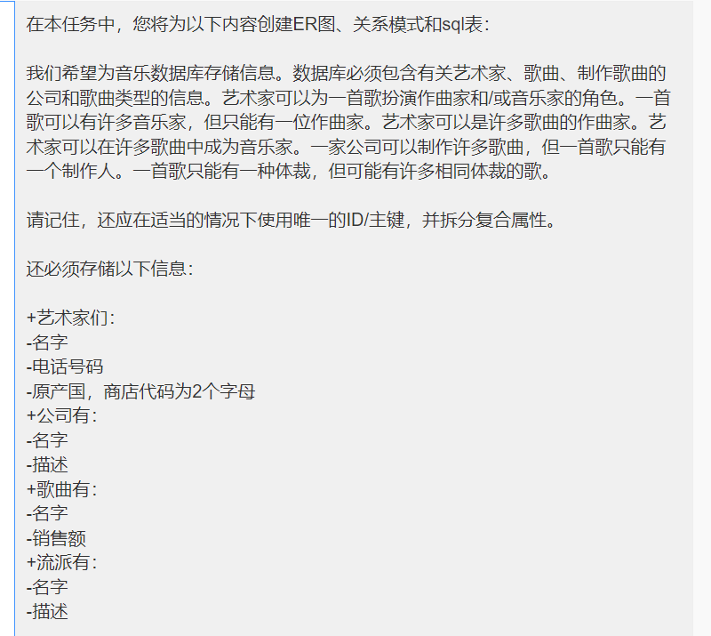

# Web Homework 4

Begin by forking this repository into your lab exercises namespace by clicking the ```fork``` button.


Select your lab exercises namespace as the fork destination on the resulting window.

Once forked, clone the repository to your computer by following the instructions for your editor.

This is an individual assignment, and must be completed without assistance from other students or external persons. You are welcome to use online resources without other limitations.

Commit and push your changes regularly. This is especially important with homework tasks, as the contents of changes, timestamps, and commit messages will be used in part to verify independence of solutions. Git usage may account for up to 50% of your grade.

Your completed code must be pushed to Gitlab at or before the 0900 NZDT on the 31st of January 2022. Late submissions will not be considered without prior arrangement.

---

## Notes


- There are **two questions** in this homework task. Attempt **both** questions.
- Each question is worth 25 marks.
- **Remember**: You're given a `package.json` file which contain all necessary dependencies, but will need to recreate the `node_modules` folders yourself by running the appropriate command.
- **Important**: Make sure to read the instructions and provided source code carefully before attempting each question.
- 

---

## Question 1 (25 marks)

In this task you will create an ER diagram, relational schema and sql tables for the following:

We wish to store information for a music database. The database must contain information about artists, songs, the companies that produce the songs and the genre of the song. An artists can play the role of composer and/or musician for a song. A song can have many musicians but can only have one composer. An artist can be composer in many songs.  An artist can be a musician in many songs. A company can produce many songs but a song can only have one producer. A song can only have one genre but there may be many songs with the same genre.

Remember that you should also use unique ids/primary keys where appropriate and split up compound attributes.

The following information must also be stored:
+ Artists have:
   - Name
   - Phone number
   - Country of origin, store with a 2 letter code
+ Companies have:
   - Names
   - Descriptions
+ Songs have:
   - Names
   - Number of sales
+ Genres have:
   - Name
   - Description




### 1A (8 marks)

Using a drawing program of your choice, draw an ER diagram that captures these relationships. Ensure that you have clearly marked up your diagram with cardinalities, attributes and keys.

Export an image of your ER diagram and include it in the `question-one` folder for submission.


### 1B (8 marks)


From your ER Diagram, generate a complete Relational Model (Relational schema). Complete this in the `question-one/relational.md` markdown file, using the indicated markup to show primary and foreign keys. Apply normalization to your Relational Model, ensuring that compound attributes are broken up.


### 1C (9 marks)

Finally, convert your Relational Model into MariaDB compatible SQL, writing the DDL with appropriate data types in the provided `question-one/database.sql` file. You should include all necessary DDL so that someone running the script can drop the tables and recreate the database. Create some sample data to insert into the tables, including it in the same file as your SQL DDL. Your sample data should include at least 3 rows for each table and allow you to test that all relationships between tables function as intended. Ensure that your SQL runs successfully on the MariaDB server.


---


Question 2 (25 marks)
-----------

In this exercise you will create a file index page that provides the names of stored files and a link to download each of them. When complete, this program should look similar to the screenshot below.


While the files themselves are stored locally, the information about each of them will be stored in an SQL database. The SQL database has been provided for you in the [`question2.sql`](question-two/sql/question2.sql) file for this

Before starting this exercise:
- run the [`question2.sql`](question-two/sql/question2.sql) SQL script against your database to create the required table.
- ensure that you have setup your username, database name and password within the [`database.js`](question-two/modules/database.js) file.


### 2A (5 marks)

Complete the [`files-dao.getAllFileEntriesSorted()`](question-two/modules/files-dao.js)) method. This should select all entries from the `practical_two_files` database table, and return an array of rows. The entries should be ordered alphabetically by their title.


### 2B (4 marks)

Complete the [`app.get()`](question-two/index.js) method. It should:

- Retrieve an array of file details from the `files-dao.getAllFileEntriesSorted()` method.
- Render the `file.handlebars` view, passing the array of file details in the context.


### 2C (4 marks)

In the [`file.handlebars`](question-two/views/file.handlebars), update the List of Files section to display the details of each passed file. You should use appropriate moustache constructs to create a version of the sample entry HTML with details from each entry in the passed array displayed where appropriate.

When complete, clicking the PDF icon should result in the appropriate PDF file being downloaded and/or opened. Check to ensure that each link shows a different file.


### 2D (4 marks)

Complete the [`files-dao.addNewFileEntry()`](question-two/modules/files-dao.js) method. This should insert the details passed as parameters as an entry in the database.

### 2E (8 marks)

Complete the [`app.post()`](question-two/index.js) method. This should receive the file, title, and description form fields submitted by the form. The file should be saved, then moved to the `public/uploaded-files` folder, maintaining the randomised filename given by multer - with ".pdf" appended to the name. Use this data to insert a new entry into the database. Finally, redirect the user back to the main page.

When complete your form should be able to submit new PDF files, then see the uploaded files inside the list of files.


