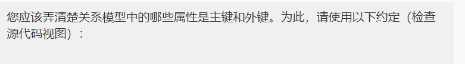

You should make it clear which attributes in your relational model are primary keys and foreign keys. To do this, use the following conventions (check the source view):

| |           |  
|----|-----------|
| Primary keys | **bold**  |
| Foreign keys | _italics_ |

For example:

entityName(**primaryKey**, attribute, _foreignKey_)

---

TODO:

