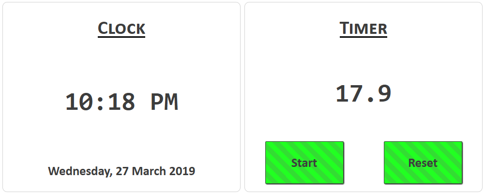

# Web Lab 07: JavaScript 2

Begin by forking this repository into your lab exercises namespace by clicking the ```fork``` button.


Select your lab exercises namespace as the fork destination on the resulting window.

Once forked, clone the repository to your computer by following the instructions for your editor.

Before starting on the exercises, take a look through the project and explore the files available to you.


## Exercise One &ndash; A Variable Gallery

Open the file `ex01/gallery.html` and examine the contents. This web page has a central image and a thumbnail view of other images in the gallery at the bottom. There is an associated images folder containing both the full size images and a folder called `thumbs` containing the thumbnails named `0.gif` to `10.gif`.

The example HTML file is given to you. When you load the page, it always displays the same image in the central part of the page—which we will refer to as the featured image area.

The aim of this exercise is to change the HTML file so it displays a random image in the 'featured' image area whenever the page is loaded, reloaded, or whenever the user clicks on the central 'featured' image. You will also support displaying a selected image when the user clicks on one of the thumbnail images.

#### A random image on page load

To begin we will address the issue of randomly loading a new image when the page is loaded, and check that is operating as desired in the browser.

Begin by calling the `loadRandomImage()` function to select and display a new image. Once this is completed, preview your file in a browser and refresh the page a few times to ensure that random images are loading. Remember to check that you write the call to the `loadRandomImage()` function.

The `changeImage()` function currently changes the featured image, but it does not update the tooltop (the text displayed when you hover over the featured image) or the description text. At the marked `TODO` positions, modify the function so that it retrieves the tooltip and description associated with the image and displays this on the page appropriately.

Preview your page and ensure this new behavior is working as expected.

#### A random image on click

Add another event handler to your JavaScript so that when the central 'featured' image is clicked, a new random image is chosen and displayed. Remember to reuse the `changeImage()` and `loadRandomImage()` functions appropriately.

Preview and test your code to ensure that a random image is still loaded when the page is refreshed, and that clicking the central image loads a new image.

#### Loading selected images

Loading a random image is fantastic, but for a featured image gallery it would be good to be able to select which image we want to see. Declare a new function with a sensible name to be used as the event handler callback, then add new event listeners that will fire when any of the `thumb-holder` elements are clicked - setting their callback functions to the function you just created. In the single event handler callback, detect which thumbnail was clicked and use this information to set the featured image to the full sized version of the clicked thumbnail.

*HINTS*:
+ Your [event listener callback function](https://developer.mozilla.org/en-US/docs/Web/API/EventTarget/addEventListener#The_event_listener_callback) can take an [Event](https://developer.mozilla.org/en-US/docs/Web/API/Event) parameter. This parameter has the property `target` which indicates which element caused the event to fire in the first place
+ The `src` property of the clicked element will contain the filename of the thumbnail image. These are named `0.gif` through `10.gif`. The number in this filename corresponds to the index in the `imageCollection` array where the full sized image details can be found
  + You can use string manipulations to extract this number from the filename
+ Your `changeImage()` function will do the image loading for you once you have determined the appropriate image number


## Exercise Two &ndash; Content From JSON

In this exercise you will loop through an array of JSON objects to generate headings, paragraphs and images for divs on your page.

You should check the reference information for JSON online:
- [JSON Reference](https://developer.mozilla.org/en-US/docs/Learn/JavaScript/Objects/JSON)

Also observe how the existing code in the `generateNavContent()` function accesses JSON content.  This should give you most of the syntax required to complete the next parts of the lab task.

Look at the `techStackInfo` variable to familiarise yourself**** with the content and structure of the data.

When you finish your page should look like this:


Tasks:

Complete the `generateNavContent()` function in the `generate-content.js` JavaScript file:

1. Inside the for loop, append the navItem to the navList in the HTML document. The `generateNavContent()` function already has a constant that stores a reference to the `ul` element.
2. Check that the nav menu displays the correct text for all four items in the `techStackInfo` array and that the `href` attribute of each `anchor` element is set to `#` + the name of the the technology from the matching JSON object. This will mean that you can later link it to elements that have a matching id.

For the next tasks you should look carefully at the image of the completed site to see what elements you should create.

Complete the `generateBodyContent()` function in the `generate-content.js` file:
1. Store a reference to the div element with the class 'container' in a 'const'/constant called container
2. Create a for loop to iterate through all JSON objects in the techStackInfo array, this will be similar to how the `generateNavContent()` function loops through all items in the techStackInfo array
3. Inside the loop: use `document.createElement( ... )` to create HTML elements for all necessary elements (divs, headings, subheadings, paragraphs and images). Look at the image of what the finished document should look like to decide what HTML elements you should create. Remember that you should create elements and store a reference to them in a variable. For example: `const  articleContainer = document.createElement("div");` . Storing a reference to an element will mean that you can use that reference later to append it to a parent element.
4. Inside the loop: Add the necessary text and attributes of all elements by retrieving information from the JSON objects when necessary
5. Inside the loop: Append all elements in the CORRECT ORDER from child to parent for them to display in the HTML document

Note: The images for exercise five are in the assets folder. Think carefully about how you set the `src` attribute for the img elements on your page.


## Exercise Three &ndash; JSON

 Inside `ex03/video_rental.html` you will find 2 tables, `#details` and `#statistics`. Using JavaScript, you will process the JSON data found in `customerdb.js` to populate these tables. Try to use good programming practices to split the problem into logical chunks and make use of functions. Do not make any changes to the HTML in the file, you must use JavaScript only to generate the output.

 Within `video_rentals.js`, you have been provided with the constant `summaryStatistics` that provides a data structure that you can use to help store the statistics that you calculate for the table.

 In the `#details` table, create and insert a `<thead>` containing the titles:

 ```json
 ["Name", "Gender", "Year born", "Year Joined", "Number of Rentals"]
 ```

 In this same table, create a `<tbody>` that contains one row for each entry in the JSON object. When complete, the output should look like that shown in the below screenshot.

 In the `#statistics` you will calculate and display some statistics about the customers found in the JSON. You will need to compute:

 + the total number of male customers
 + the total number of females customers
 + the total number of people in the age ranges 0-30, 31-64, and 65+
 + the tally of customers in various "loyalty status" tiers, where:
   - those who borrowed more than 4 videos a week during the period of their membership are in the "gold" category.
   - Those who borrowed between 1 and 4 videos per week are in the "silver" category
   - those with less than one video out per week are of the "bronze" category.

 The age of each user can be calculated using the current year and the year each member was born. Similarly to calculate which loyalty tier each user belongs to, you will need to compute how long they have been a member of the store, and use their total number of rentals to establish an average `movies_per_week` value.

 Once these statistics have been calculated, display them as shown in the below screenshot.

 


## Exercise Four &ndash; Dolphins

You are provided the components of an image — a selection of backgrounds of the sea and sky, and of some marine mammals. You’re also provided with `ex04/create_scenery.html` and `ex04/create_scenery.css` that set up the placement of the images and form controls.

You will use JavaScript event handlers to make these form controls interactive - allowing users to modify the overall composite image made up of background and dolphin/orca images.


In the `ex04/create_scenery.js` file, write the JavaScript code that allows for the following:

+ The radio buttons should allow the user to select between the different scenic backgrounds. When a new radio button is selected, the displayed background should be displayed.
  - Use a similar approach as used in the ex02 gallery to identify which radio button was selected. You will find that the `id` of the selected radio button will help you determine which file in the `images/dolphins/` directory should be loaded.
+ The checkboxes should enable the user to choose which dolphin/orca images should be displayed on the selected background.
  - Again, use attribute values from the clicked element to help determine what image should be show or hidden. As a further hint:

```javascript 1.8
/* It is perfectly valid to concatenate a value together to form an argument
    * for querySelector(). The following will select the element with id="something"
    */
let someString = "something";
let selected = document.querySelector("#" + someString);
```

+ The range slider controls should permit the user to alter the size and position of the displayed dolphin images.
  - *HINT*: The easiest approach to this is to apply a CSS transform property containing translateX(), translateY() and scale() transforms in a single line to each of the dolphins. You can accomplish this in code by storing the values to be passed to each of these methods in variables, modifying the values of these variables when the sliders move and then calling a helper function that sets this property on each dolphin.


## Exercise Five &ndash; Animated Book

You're provided with a web page containing an "animated book" of animal images in the `ex05/animatedbook.html` file. The solution is pure CSS, and the page turning is not interactive but animated with key-frames using different delay times.

Preview the animated book. Be aware that it takes 5 seconds before every page 'leaf', including the first one, starts turning over.

The purpose of this exercise is to use JavaScript so that the page turning animation is triggered when the user clicks on the book instead of this happening automatically.

*HINTS*:
+ You will first want to clear the existing animation delays.
+ Rename the `.page` CSS style definition to `.pageAnimation` and set this programmatically on the specific page that is clicked for the animation to take place.
+ When the page flipping animation on a clicked page has ended, it fires an [`animationend` event](https://developer.mozilla.org/en-US/docs/Web/API/HTMLElement/animationend_event). At that point, you will need to bring the next page up front in the stacking order (by adjusting its z-index)


## Exercise Six &ndash; Clever Clock

Begin by opening the `ex06/clever_clock.html` file and previewing it in your browser of choice.

For this exercise you will be required to create several different types of event handling code. Along with click handlers, you will be using a combination of the `setTimeout()`  and `setInterval()` methods. This will require you to research these methods and how structure your code appropriately to handle these events. There are lots of bugs that can happen if references to timers are not managed in the right way so test and debug your code regularly. There is a commented example of a timer in the `example` folder that you may use to help develop your understanding of how to structure timer events.

Remember that you need to think carefully about how you structure all of your event handling code so that events happen when you expect them to and that you manage the scope of the variables in your code.

By making changes **only** within the `clever_clock.js` file (No touching the HTML or CSS!) you will accomplish the following:

### Clock Task

+ In the left-hand 'Clock' pane, you will update the current time **every second**.
  - You will display the time in 12-hour format, with the `hours` number ranging from 0-12 only
  - You will display `AM` or `PM` appropriately for if the time shown is in the morning or afternoon
  - The `hours` and `minutes` values should always be 2 digits long. If the `hours` or `minutes` values only have a single digit, you will pad it from the left with zeros
    - *HINT*: Look into the [`padStart()`](https://developer.mozilla.org/en-US/docs/Web/JavaScript/Reference/Global_Objects/String/padStart) function that string support
  + Each second, you will show or hide the colon separating the `hours` and `minutes` values, generating a blinking effect
  + Ensure that the clock is updated as soon as the page loads. There should be no point where the default `00:00 AM` value should be seen
+ In the bottom of the left-hand 'Clock' pane, you will update the current date periodically
  - This date should be in a form like `Thursday, 28 March 2019`, with the weekday and month spelled out completely
    + *HINT*: You could do this long hand, or if you are feeling like a (possible) shortcut you could look into [`Date.toLocaleDateString()`](https://developer.mozilla.org/en-US/docs/Web/JavaScript/Reference/Global_Objects/Date/toLocaleDateString). The locale language tag for New Zealand is `en-NZ`.
  - Ensure that the date is updated as soon as the page loads.

### Timer Task

For this task, look carefully at the screenshots below and the existing code in the project.

+ In the right-hand 'Timer' panel, you will implement a simple stopwatch.
  - When the `Start` button is pressed it should change to display the text `Stop`
  - When the `Stop` button is pressed it should change to display the text `Start`
  - When the `Start` button is pressed, you should update the timer display **10 times per second** to reflect the amount of time elapsed
    + *HINT*: You will count up each time the timer goes off. Do not count up in `0.1` increments as your number will start to drift due to floating point error accumulation. Count up in whole number increments and divide the number down when it is time to display
  - When the `Stop` button is pressed, if the timer is displaying a number greater than `0.0`, start a **30 second countdown**. When this timer finishes, reset the timer display to `0.0`
    + If the timer is restarted before this timeout has finished, the timer should be cleared and the timer should continue counting from where it left off
  - When the `Reset` button is pressed, reset the timer display to `0.0` **IF**
    + The timer is not currently running, **and**
    + The timer display is anything other than `0.0`
  - If the `Reset` button is pressed while the automatic reset countdown is active, the timer should be cleared
  - Apply the CSS class `.button_enabled` or `.button_disabled` to the `Start`/`Stop`/`Reset` buttons depending on if the button will do anything if it is clicked at that moment.
    + Eg, the `Reset` button should have the `.button_disabled` class when the timer is running, as clicking it will do nothing, but should have the `.button_enabled` class if the timer is stopped and the display is not `0.0`

When complete, your page will look like the following when the timer is paused:


.. like the following when the timer is running:


.. and like the following when the timer has been stopped but not cleared:



Ensure you test your page as you work to ensure that it is functioning as intended at each stage. Remember to use the browser inspection console to look for errors while developing.

*HINTS*:
+ Remember to record the returned values from `setTimeout()` and `setInterval()` calls. You will need these values if you want to stop the timers
+ You can use the recorded timer values to determine if the timer is running or not. Set these into a variable when the timer starts, and set the value to `undefined` when the timer stops. If you look at this variable and it is not `undefined` then you know the timer is running.
