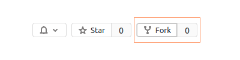
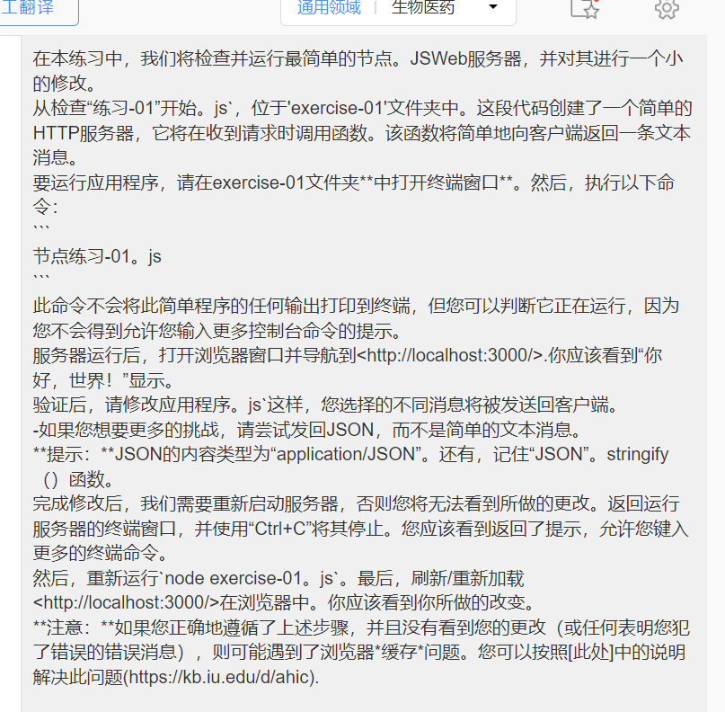
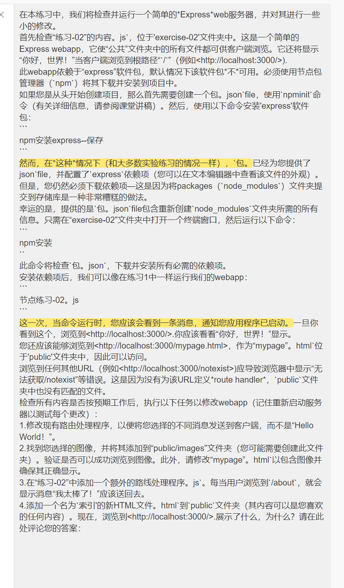

# Web Lab 10 &ndash; node.js &amp; Express




Begin by forking this repository into your namespace by clicking the ```fork``` button above, then selecting your username from the resulting window. Once completed, click the ```clone``` button, copy the ```Clone with HTTPS``` value. Open IntelliJ, and from the welcome screen click ```Check out from Version Control -> Git```, then paste the copied URL into the ```URL``` field of the resulting window. Provide your GitLab username and password if prompted.

**Note:** Whenever this lab mentions opening a "terminal window", any terminal *should* work. However, the work has only been tested using `git bash`.


## Exercise Zero &ndash; Installing node.js

If you're using the lab machines, you'll find that all necessary software is already installed. However, if you are using your own lab machines, you'll need to install the `node.js` runtime.

To do this, browse to the [node.js website](https://nodejs.org/en/), and follow the instructions. The **LTS** version should be absolutely fine - you don't need to install the latest version (though it probably won't hurt!).

When installing, if the installer asks you to add something to your `PATH`, then you should allow this.

Once the install is complete, you can verify it by opening a terminal and typing the following commands:

```
npm --version
node --version
```

These should both print a version number to the console, and not give any errors.

Be sure to seek help from the lecturer / tutors if you believe you've installed correctly but are getting errors.


## Exercise One &ndash; The simplest server&trade;

In this exercise, we will examine and run the simplest possible node.js web server, and make a small modification to it.

Begin by examining `exercise-01.js`, located within the `exercise-01` folder. The code creates a simple HTTP server, which will call a function whenever it receives a request. That function will simply return a text message to the client.

To run the app, open a terminal window **in the exercise-01 folder**. Then, execute the following command:

```
node exercise-01.js
```

This command won't print any output to the terminal for this simple program - but you can tell it's running as you won't get the prompt allowing you to enter more console commands.

Once the server is running, open a browser window and navigate to <http://localhost:3000/>. You should see the message "Hello, World!" displayed.

Once you've verified this, modify `app.js` so that a different message of your choice will be sent back to the client instead.

- If you'd like more of a challenge, try sending JSON back rather than a simple text message.

  **Hint:** The content type for JSON is `application/json`. And, remember the `JSON.stringify()` function.

Once you've made your modification, we'll need to restart the server, or you won't be able to see the changes you've made. Go back to the terminal window running your server, and stop it by using `Ctrl+C`. You should see that you get your prompt back, allowing you to type more terminal commands.

Then, rerun `node exercise-01.js`. Finally, refresh / reload <http://localhost:3000/> in your browser. You should see the change you made.

**Note:** If you've followed the steps above correctly, and don't see your changes (or any error messages indicating you made a mistake), you may have encountered a browser *caching* issue. You can resolve this by following the instructions found [here](https://kb.iu.edu/d/ahic).




## Exercise Two &ndash; The simplest Express webapp&trade;

In this exercise, we will examine and run a simple *Express* web server, and make some small modifications to it.

Begin by examining the contents of `exercise-02.js`, located in the `exercise-02` folder. This is a simple Express webapp, which makes all files in the "public" folder available for browsing by clients. It also will display "Hello World!" to clients when they browse to the root path "`/`" (e.g. <http://localhost:3000/>).

This webapp has a dependency on the `express` package, which is *not* available by default. It must be downloaded and installed into your project using the Node Package Manager (`npm`).

If you were creating your project from scratch, you would first need to create a `package.json` file using the `npm init` command (see lecture notes for details). You would then install the `express` package using the following command:

```
npm install express --save
```

In *this* case however (and as will be the case with most lab exercises), the `package.json` file has already been provided for you, and configured with the `express` dependency (you can examine the file in a text editor to see how this looks). You must, however, still download the dependencies - this is because it is extremely bad practice for the packages (`node_modules`) folder to be committed to a repository.

Luckily, the provided `package.json` file contains all the information necessary to recreate the `node_modules` folder. Simply open a terminal window in the `exercise-02` folder and run the following command:

```
npm install
```

This command will examine `package.json`, and download and install all required dependencies.

Once dependencies are installed, we can run our webapp just as we did for Exercise One:

```
node exercise-02.js
```

This time, when the command is run, you should see a message notifying you that the app has started. Once you see this, browse to <http://localhost:3000/>. You should see "Hello World!" displayed.

You should also be able to browse to <http://localhost:3000/mypage.html>, as `mypage.html` is located within the `public` folder, and therefore accessible.

Browsing to any other URL (e.g. <http://localhost:3000/notexist>) should result in an error such as `cannot GET /notexist` being displayed in the browser. This is because there is no *route handler* defined for that URL, and also no matching file in the `public` folder.

Once you've checked that everything works as expected, perform the following tasks to modify the webapp (remembering to restart the server to test each change):

1. Modify the existing route handler so a different message, of your choice, is sent to the client instead of "Hello World!".

2. Find an image of your choice, and add it to the `public/images` folder (you may need to create this folder). Verify that you can successfully browse to your image. In addition, modify `mypage.html` to include your image and make sure that it displays correctly.

3. Add an additional route handler to `exercise-02.js`. Whenever the user browses to `/about`, the message "I am awesome!" should be sent back.

4. Add a new HTML file called `index.html` to the `public` folder (its contents can be anything you like). Now, browse to <http://localhost:3000/>. What is displayed, and why? Comment your answer here:

```
Your answer here.
```



原因： 默认会先去public里的Index.html找内容返回


## Exercise Three &ndash; Serving up JSON

Using Express, it is trivial to send JSON data to clients - we simply use the *response* object's `json()` method from within our route handler. For example:

```js
app.get("/gimmeJSON", function (req, res) {
    const person = {
        name: "Walter White",
        address: "308 Negra Arroyo Lane"
    };

    res.json(person);
});
```

In this exercise, we will examine how we can use this functionality to help link our front-end code to our back-end code (using `fetch()`).

To begin, examine `exercise-03.js`, within the `exercise-03` folder. In particular, focus on the `/gimmeJSON` route handler. In addition, examine the client-side files `index.html` and `js/exercise-03-client.js` (located in the `public` folder). You'll see how we can use `fetch()`, within our client-side JavaScript, to access results returned by our server-side JavaScript.

Run the webapp (remembering to `npm install` first), and verify that Walter White's details show up in your browser window when browsing to <http://localhost:3000/>. Then, modify the webapp as follows:

1. Modify the existing route handler so it returns the details of a different person of your choice.

2. As well as a name and address, give the person some additional info of your choice, such as a phone number. Then, modify `index.html` and `exercise-03-client.js` so the additional info is displayed.

3. Add an additional route handler to the webapp. Whenever a client makes a GET request to `/randomNumber`, a random *integer* (i.e. whole number) between `0` and `100` should be generated. The handler should return JSON of the following form to the client:

   ```js
   const json = {
       number: RND_NUM
   };
   ```

   where `RND_NUM` is the random number you generated. **Hint:** See [this page](https://www.geeksforgeeks.org/javascript-math-random-function/) for more info on random numbers in JavaScript.
  
   Once you've created your handler, verify that it works by browsing to <http://localhost:3000/randomNumber>. A different random number should be returned each time.

4. Add code to `exercise-03-client.js` so that when the `generate-random` `<button>` is clicked, a `fetch()` call is made to your new route handler. When the result is retrieved, convert it to json, and display the `number` that's returned in the `random-number` `<span>`. Again, make sure to test your functionality.


## Exercise Four &ndash; Sending data to the server

There are several ways in which clients can send data to the server. We will investigate some of them in this exercise.

To begin, examine the `exercise-04.js` webapp, and associated `index.html` and `exercise-04-client.js` client files. See how the client sends data to the server in three ways:

1. Via a `fetch()` in `exercise-04-client.js`, with the query string `name=Andrew`.

2. Via the first `<form>` in `index.html`, with `method=GET`.

3. Via the second `<form>` in `index.html`, with `method=POST`.

Also note the third `<form>`, which contains multiple `<input>`s with the same `name`.

Run the webapp, examine the four route handlers defined in `exercise-04.js`, and make sure you understand how the client is sending data in each case. Then, make the following modifications:

1. Modify the first `<form>` by adding another `<input>` (you can ask the user for any info you like). Modify the corresponding route handler such that your new input is read by the server, and its value is returned in the JSON back to the client.

2. Repeat step 1, but for the second `<form>`. Try to add a different kind of `<input>` this time.

3. Change the final `<form>` (the one with the checkboxes) to use `method=POST` instead of `method=GET`. Modify the corresponding route handler such that the form submission will still be accepted by the server.

4. Modify the `fetch()` in `exercise-04-client.js`, to send an additional parameter other than just `name`. For example, you could send a `title` (whose values might be "Mr", "Mrs", "Ms", "Dr", etc). Modify the corresponding route handler such that your new parameter is also used in the generated greeting (using the `title` example, the new greeting might be "Hello, Dr. Andrew!", for example).

   **Hint:** Any number of query parameters can be chained together using `&`. For example: `.../getGreeting?name=Andrew&title=Mr`.

## Exercise Five &ndash; Revisiting the questionnaire

Recall the questionnaire form you develope in Lab Three, Exercise One:


You'll find a model solution to this exercise in the `exercise-05/public` folder (`form.html`), except that the form's `action` and `method` have been removed.

At the marked location within `exercise-05.js`, add a route handler (the path can be anything you like, but try and have it make sense). When the user browses to <http://localhost:3000/form.html>, then submits the form with a `GET` request, your route handler should be called, read all the submitted values, and send them back to the client as JSON - similarly to the examples in Exercise Four.

Once you've done this, add an appropriate `action` and `method` to the `<form>` in `form.html`, then run and test your server. Make sure all data is read in as expected.

Next, extend your webapp such that the form can be submitted via `POST` as well as `GET`. You can achieve this by adding a new route handler to the same path, but a different method. When adding the new handler, try to *reuse as much code as possible* - the vast majority of your code should **not** need to be duplicated!

Once you're done, test your code by submitting the form as-is (to test that you didn't break existing functionality), *then* by changing the form's `method` to `POST`, and verifying that everything works as intended.
