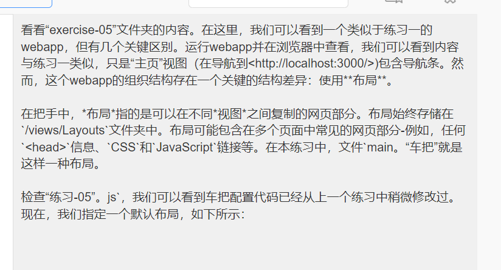

Web Lab 11 &ndash; Handlebars
==========
Begin by forking this repository into your namespace by clicking the `fork` button above, then selecting your username from the resulting window. Once completed, click the `clone` button, copy the `Clone with HTTPS` value. Then, clone your fork onto your local machine using the `git clone` command.

Remember to commit and push your work regularly for backup purposes. Practicing branching and merging is also highly recommended!

**Note:** Whenever this lab mentions opening a "terminal window", any terminal *should* work. However, the work has only been tested using `git bash`.

**Note 2:** Remember to run `npm install` for each webapp, to make sure all necessary packages (including Express and Handlebars) are installed.


Exercise One &ndash; My first Handlebars webapp
-----------------------------
The `exercise01` folder contains an Express webapp which is configured to use the Handlebars view engine. Currently, the webapp is configured with a single route handler, as can be seen in `exercise-01.js` - whenever it receives a `GET` request to `/` (the root path), the `home` view will be *rendered*.

To *render* a view means to take the contents of the view, configure it, add any data to it, and turn it into the HTML code which is sent back to the browser. In the case of Handlebars, views are located within the `views` folder. The *name* of a view (as you should reference it within your code) is the same as the name of the file, minus the `.handlebars` extension. For example, the line `res.render("home")` refers to the `home.handlebars` file, located in the `views` folder.

This simple example doesn't pass any data to the view - the contents of `home.handlebars` is completely valid HTML with no Handlebars-specific markup at this point.

Run the webapp and browse to <http://localhost:3000/> - you should see the contents of `home.handlebars` appear within your browser.

To complete this exercise, add an additional route handler to your webapp for `/about`. Users navigating to this route should cause the `about` view to be rendered. In addition, add a link to this new page (i.e. `<a>`) within the `home` view.


Exercise Two &ndash; Sending data to your views
-----------------------------
Continuing on from Exercise One, modify the default route handler (`/`) by first adding the following code before the call to `res.render("home")`:

```js
const context = {
    title: "Supplying data to views"
};
```

Once that's done, supply this `context` object to the view, by modifying the next line as follows:

```js
res.render("home", context);
```

Now, any properties of the `context` object will be available for access within `home.handlebars`. To test this, replace the `<h1>` on the page with the following:

```handlebars
<h1>{{title}}</h1>
```

When the view is rendered, `{{title}}` will be replaced with the value of the supplied context object's `title` property (i.e. "Supplying data to views", in this case). Verify this works by viewing the result in your browser. Check out the actual HTML supplied to the browser by using your browser's "view source" feature. Notice the replacement which has taken place.

- **Note:** If you make a change to one of the `.handlebars` files, or any file in the `public` folder, you should be able to view the change simply by refreshing the page in your browser. However, if you make a change to the `node.js` code (i.e. `exercise-01.js`), you'll need to *restart* the webapp.

Next, modify your `/about` route handler, by adding a context object with at least three pieces of information about you (for example, name, address, and phone number). Supply this context object to the `about` view when rendered, and modify `about.handlebars` to display the information you've supplied.


Exercise Three &ndash; Handlebars *if*s and *loop*s
-----------------------------
Open the `exercise-03` folder. There, you'll see several files. The webapp is currently set up with an `index.html` file containing links to two other routes: `/favoriteThings` and `/articleSummaries`. Partial route handlers for these two routes are defined within `exercise-03.js`.

Currently, the route handler for `/favoriteThings` has a `context` object defined, which itself contains an array called `favorites`. Currently, this array is empty. We can see that the `context` object is sent to the `favorites` view for rendering.

Open `favorites.handlebars` and, at the marked location within the file, add some logic using the `{{#if}}` / `{{else}}` helper. *If* `favorites` is defined and contains some data, a message should be displayed to the user such as:

```html
<p>I have favorites!</p>
```

Otherwise (*else*), a message should be displayed to the user such as:

```html
<p>I have no favorites :(</p>
```

Verify this works by running `exercise-03.js` as is. Your "no favorites" message should appear to the user when navigating to <http://localhost:3000/favoriteThings>. Then, modify the `favorites` array to contain some actual elements, and restart the webapp. Now, your "I have favorites" message should appear instead.

Next, rather than displaying a message suchas "I have favorites" when the array contains data, we will instead display a `<ol>`, which will contain one `<li>` for each favorite in the array. To do this, use the `{{#each}}` helper as demonstrated in lectures.


Exercise Four &ndash; An article summary page
-----------------------------
Continuing on from Exercise Three, we'll now gain some further practice with `{{#if}}` and `{{#each}}`, by displaying a list of articles on a page.

The `/articleSummaries` route handler is currently set up to create a list of articles, and send them to the `articles` view for rendering. Within `articles.handlebars`, examine the provided `articles` array. If there are no articles, an error message such as "There are no articles" should be displayed. Otherwise, a `<div>` with the `grid-3` class should be created. Inside that `<div>`, each article should be rendered as a `card`. An example structure of a card is given here (you can see how each of these CSS classes will be rendered by examining `/public/css/site.css`):


```html
<div class="card">
    
    <div class="card-body">
        <h3>ARTICLE TITLE GOES HERE</h3>
        <p>ARTICLE CONTENT GOES HERE</p>
    </div>
</div>
```

Exercise Five &ndash; Handlebars Layouts
-----------------------------
Take a look at the contents of the `exercise-05` folder. Here, we can see a webapp similar to that in Exercise One, but with a few key differences. Running the webapp and viewing it in our browser, we can see that the contents looks similar to Exercise One, except that the `home` view (seen when navigating to <http://localhost:3000/>) contains a nav bar. However, there is a key structural difference in the organization of this webapp: the use of a **layout**.

In Handlebars, a *layout* refers to part of a webpage which can be replicated between different *views*. Layouts are always stored in the `/views/layouts` folder. Layouts may contain parts of a webpage which are common amongst multiple pages - for example, any `<head>` information, `CSS` and `JavaScript` links, etc. In this exercise, the file `main.handlebars` is a layout which does exactly this.

Examining `exercise-05.js`, we can see that the Handlebars configuration code has been slightly modified from previous exercise. Now, we're specifying a default layout, as follows:



```js
app.engine("handlebars", handlebars({
    defaultLayout: "main"
}));
```

This means, that whenever we render a view (using `res.render()`), unless we override this default, a layout called `main` will be used (corresponding to a file named `main.handlebars`, located in the `/views/layouts` folder).

To build the final HTML page, Handlebars will first load the given *layout* file. It will then replace the `{{{body}}}` declaration with the contents of the specified *view* file. For example, the following line of code will replace `{{{body}}}` with the contents of `/views/home.handlebars`:


```js
res.render("home");
```

Visualize what's happening by running the provided webapp, and viewing it in your browser. Look at the page source (i.e. generated HTML), for both the `/` and `/about` routes. Notice that the contents of `main.handlebars` is shared between them.

Once you've verified this, move the `<nav>` that's defined in `home.handlebars`, into an appropriate location within `main.handlebars`. Once you've done this, the navbar should be visible in both the `/` and `/about` pages. Check that this functions as expected.


Exercise Six &ndash; Dynamic layouts
-----------------------------
Continuing on from Exercise Five, we'll further modify the `main.handlebars` view so that whichever page is currently being displayed, that page's nav link will appear "active" (i.e. have the `active` CSS class applied).

To begin, examine the two links within the navbar. You'll see that the "Home" link currently has the `active` CSS class. This class makes it appear darker in color compared with the "About" link (see `site.css` for details). We want to apply the `active` class to whichever link corresponds to the current page, and not any of the others. This would be trivial if we would copy / paste the navbar into each separate Handlebars view. We could then slightly modify each one as we needed. However, we also want to make use of Handlebars layouts to reduce code duplication where possible. Since the majority of the navbar is identical (only the CSS classes applied to the links are different), we will keep it defined within `main.handlebars` and use the `{{#if}}` helper to achieve the desired functionality.

To start with, we need a way to tell Handlebars what page we're currently on. We can do this by supplying appropriate data when rendering the views. For both the `/` and `/about` route handlers, create a `context` object and supply it to the view renderer, as we have done for previous exercises. Within the `/` handler's context object, define a property called `homePage`, and set it to `true`. Similarly, define a property called `aboutPage` and set it to `true` within the `/about` handler's context. For example:


```js
const context = {
    homePage: true
};
```

Once we've supplied this data to our view engine, we can then use the values we've defined. Modify each of the links in `main.handlebars` such that it is only `active` if the corresponding property has been declared (e.g. the "Home" link should appear active if the `homePage` property has been set to true). For example:


```handlebars
<a href="./home" class="nav-button{{#if homePage}} active{{/if}}">Home</a>
```

Once this has been completed, test your webapp. When navigating between pages, you should notice that the link corresponding to the current page will appear active, and others will not.


