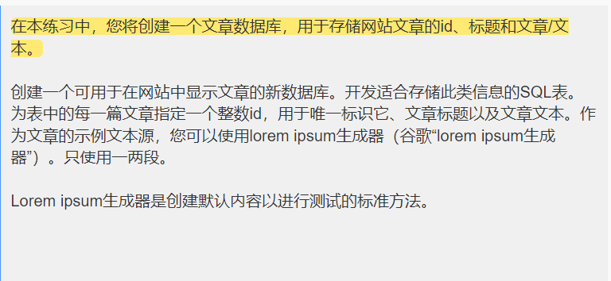
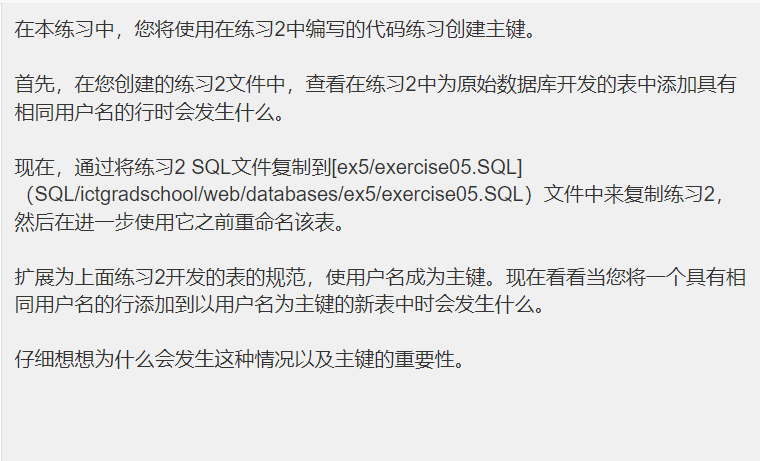
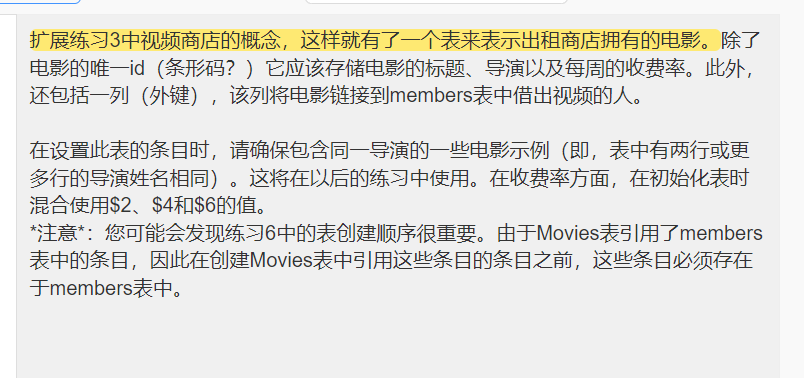
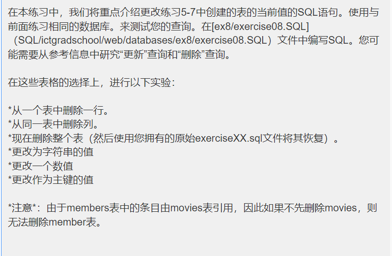

# Web Lab 13 &ndash; Databases 1

Begin by forking this repository into your lab exercises namespace by clicking the ```fork``` button.


Select your lab exercises namespace as the fork destination on the resulting window.

Once forked, clone the repository to your computer by following the instructions for your editor.

Before starting on the exercises, take a look through the project and explore the files available to you.

## Preamble

The online tutorial for SQL we make use of is the one at TutorialsPoint:

 - [http://www.tutorialspoint.com/sql/](http://www.tutorialspoint.com/sql/)

of which the PDF version is at:

 - [http://www.tutorialspoint.com/sql/sql_tutorial.pdf](http://www.tutorialspoint.com/sql/sql_tutorial.pdf)

 For this first lab on this topic, work your way through pages 1–24 (inclusive).  In terms of the HTML version, these  chapters are grouped under the heading "SQL Tutorial".  (We will be looking at a selection of the later chapters, under the  heading "Advanced SQL" in the next lab).

 In this lab you will be writing SQL statements in the exercises below on your own PC, then executing them on a remote server to which you have limited access.  If you encounter an issue with your permissions during these exercise, please talk to your lecturer and they will help you resolve the problem. 

 In reading through the highlighted sections of the online tutorial, if you want to try out some examples for yourself of the  sorts of SQL statements you are reading about, then there are some websites that allow you to try out example syntax "live".  The Try it yourself feature of W3Schools that you have most likely encountered for JavaScript and CSS, for instance, is also provided for SQL:

- [http://www.w3schools.com/sql/sql_intro.asp](http://www.w3schools.com/sql/sql_intro.asp)

Most mainstream web browsers are compatible with the site for entering SQL select statements, as these only need to read information from a database. To try out statements that create tables and modify values, then W3Schools needs you to be using a web browser with WebSQL support: 

Chrome, Safari, or Opera (at the time or writing).


## Getting Started

Before you can begin executing your SQL, you will need to connect to the target database. There are two ways to do this, and it is suggested that you ensure that both work for you.

### Connecting via a web interface:

The hosted MariaDB server instance has the phpmyadmin management interface installed and accessible to you. To connect to this, visit [https://trex-sandwich.com/db/](https://trex-sandwich.com/db/) and log in using the username and password supplied to you by your lecturer.

Familiarize yourself with this interface and experiment with the various interface tabs. You will find that if you select your database from the left of the interface, you will be able to execute arbitrary SQL commands on that database, or use wizards to create tables and queries.

### Connecting via IntelliJ:

Open your SQL project, then open the "Database" tab from the `View | Tool Window | Database` menu. In the Database tab, click the green "+" button and select Data Source | MariaDB from the menu. In the "Data Sources and Drivers" window, set the "Host" field to `db.trex-sandwich.com` . In the "Database" and "User" fields, supply your provided username, and fill in your password. Finally, if you see the following message at the bottom of the window:


Click the "Download" link to let IntelliJ fetch the appropriate drivers, then click the "Test Connection" button. If this succeeds, hit "Apply" then "OK" to complete the configuration; otherwise talk to your lecturer for assistance.

You will now be able to execute SQL statements on the remote server directly from your editor window.


## Exercise One 

Begin by opening the [ex1/exercise01.sql](sql/ictgradschool/web/databases/ex1/exercise01.sql) file and reading the contents of the file. Follow the instructions contained within it to verify that your connection to the server is ok, and that you can see the results on both the web interface and through the IDE.


## Exercise Two

Take this JSON as a source of inspiration:

     {
         username: "programmer1",
         first_name: "Bill",
         last_name: "Gates",
         email: "bill@microsoft.com"
     }

Create an SQL table suitable for storing the JSON data. Next, add SQL insert statements to populate the table with examples of registered users. Be sure to include one entry where the person's first name is "Peter", another that is "Pete", and another where their last name is "Peterson". This will be used in a later exercise. You should create at least 10 registered users.


## Exercise Three

Create an SQL table suitable for storing the JSON data in the table below. Next, add SQL insert statements to populate the table with the data in the JSON below.


    var customers = [
        { "name" : "Peter Jackson", "gender" : "male", "year_born" : 1961, "joined" : "1997", "num_hires" : 17000 },    
        { "name" : "Jane Campion", "gender" : "female", "year_born" : 1954, "joined" : "1980", "num_hires" : 30000 }, 
        { "name" : "Roger Donaldson", "gender" : "male", "year_born" : 1945, "joined" : "1980", "num_hires" : 12000 },  
        { "name" : "Temuera Morrison", "gender" : "male", "year_born" : 1960, "joined" : "1995", "num_hires" : 15500 },    
        { "name" : "Russell Crowe", "gender" : "male", "year_born" : 1964, "joined" : "1990", "num_hires" : 10000 },    
        { "name" : "Lucy Lawless", "gender" : "female", "year_born" : 1968, "joined" : "1995", "num_hires" : 5000 },            
        { "name" : "Michael Hurst", "gender" : "male", "year_born" : 1957, "joined" : "2000", "num_hires" : 15000 },        
        { "name" : "Andrew Niccol", "gender" : "male", "year_born" : 1964, "joined" : "1997", "num_hires" : 3500 },     
        { "name" : "Kiri Te Kanawa", "gender" : "female", "year_born" : 1944, "joined" : "1997", "num_hires" : 500 },       
        { "name" : "Lorde", "gender" : "female", "year_born" : 1996, "joined" : "2010", "num_hires" : 1000 },       
        { "name" : "Scribe", "gender" : "male", "year_born" : 1979, "joined" : "2000", "num_hires" : 5000 },
        { "name" : "Kimbra", "gender" : "female", "year_born" : 1990, "joined" : "2005", "num_hires" : 7000 },    
        { "name" : "Neil Finn", "gender" : "male", "year_born" : 1958, "joined" : "1985", "num_hires" : 6000 },     
        { "name" : "Anika Moa", "gender" : "female", "year_born" : 1980, "joined" : "2000", "num_hires" : 700 },    
        { "name" : "Bic Runga", "gender" : "female", "year_born" : 1976, "joined" : "1995", "num_hires" : 5000 },    
        { "name" : "Ernest Rutherford", "gender" : "male", "year_born" : 1871, "joined" : "1930", "num_hires" : 4200 },    
        { "name" : "Kate Sheppard", "gender" : "female", "year_born" : 1847, "joined" : "1930", "num_hires" : 1000 },    
        { "name" : "Apirana Turupa Ngata", "gender" : "male", "year_born" : 1874, "joined" : "1920", "num_hires" : 3500 },    
        { "name" : "Edmund Hillary", "gender" : "male", "year_born" : 1919, "joined" : "1955", "num_hires" : 10000 },    
        { "name" : "Katherine Mansfield", "gender" : "female", "year_born" : 1888, "joined" : "1920", "num_hires" : 2000 },    
        { "name" : "Margaret Mahy", "gender" : "female", "year_born" : 1936, "joined" : "1985", "num_hires" : 5000 },    
        { "name" : "John Key", "gender" : "male", "year_born" : 1961, "joined" : "1990", "num_hires" : 20000 },    
        { "name" : "Sonny Bill Williams", "gender" : "male", "year_born" : 1985, "joined" : "1995", "num_hires" : 15000 },    
        { "name" : "Dan Carter", "gender" : "male", "year_born" : 1982, "joined" : "1990", "num_hires" : 20000 },    
        { "name" : "Bernice Mene", "gender" : "female", "year_born" : 1975, "joined" : "1990", "num_hires" : 30000 }    
    ];

## Exercise Four

In this exercise you will create an articles database that can store the id, title and article/text of articles for a website. 

Create a new database that could be used to display articles in a website. Develop an SQL table suitable for storing such information. Give each article in the table an integer id for uniquely identifying it, a title for the article along with the text of the article. As a source of sample text for the articles, you could use a lorem ipsum generator (Google 'lorem ipsum generator'). Only use a paragraph or two. 

Lorem ipsum generators are a standard way of creating default content to test things.



## Exercise Five

In this exercise you will use the code you wrote in exercise 2 to practice creating primary keys.

First, in the Exercise 2 file you created, see what happens when you add a row with the same username to the table developed for the original database in Exercise 2.

Now copy Exercise 2 by copying the Exercise 2 SQL file into the [ex5/exercise05.sql](sql/ictgradschool/web/databases/ex5/exercise05.sql) file, then rename the table before working with it further. 

Extend the specification of the table developed for Exercise 2 above so the username is a primary key. Now see what happens when you add a row with the same username to the new table where the username is the primary key.

Think carefully about why this happens and the importance of primary keys.



## Exercise Six

Extend the idea of the video store from Exercise 3 so there is a table that represents the movies the rental store has. In addition to a unique id for the movie (bar-code?) it should store the title of the movie, who directed it, and its weekly charge-out rate. Additionally, include a column (foreign key) that links the movie to who in the members table has the video out on loan.

In setting up entries for this table, be sure to include some movie examples by the same director (i.e. so there are two or more rows in the table where the director's name is the same).  This will be used in a later exercise.  In terms of charge-out rate, use a mix of the values $2, $4, and $6 when initializing the table.

*Note*: You may find that the sequence of table creation in your Exercise 6 matters. Since the Movies table references entries in your members table, those entries must exist in the members table before the entries in the Movies table that refer to them can be created.



## Exercise Seven

Continue the development of articles database example from Exercise 4. Add a table for storing comments that are posted about a particular article (imagine them being displayed at the bottom of the article when that particular page is called up in the web site).  Comments should have their own unique ID as its primary key. It should also contain a foreign key of the article ID the comment applies to. The comment ID should be automatically generated - Look into the `AUTO_INCREMENT` qualifier.


## Exercise Eight

In this exercise we concentrate on SQL statements that change the current values of the tables created in Exercises 5-7. Use the same database developed for the previous exercises. To test your queries. Write your SQL in the [ex8/exercise08.sql](sql/ictgradschool/web/databases/ex8/exercise08.sql) file. You may need to research `UPDATE` queries and `DELETE` queries from the reference information.

Over a selection of these tables, experiment with the following:
* Delete a row from one table.
* Delete a column from the same table.
* Now delete the entire table (and then reinstate it with the original exerciseXX.sql file you have).
* Change a value that is a string
* Change a value that is a numeric value
* Change a value that is a primary key

*Note*: since entries in the members table are referenced by the movies table, you can't delete the member table without deleting Movies first.



## Exercise Nine

In this exercise we concentrate on SQL select statements.  Use the same database developed and used in the previous exercises.
 Write your queries in the [ex9/exercise09.sql](sql/ictgradschool/web/databases/ex9/exercise09.sql) file.

Devise SQL statements that display the following:

* All information about all the members of the video store

* Everything about all the members of the video store, except the number of video hires they have

* All the titles to the articles that have been written

* All the directors of the movies the video store has (without repeating any names).

* All the video titles that rent for $2 or less a week.

* From the table created in Exercise Two:
    * A sorted list of all the usernames that have been registered.
    * All the usernames where the user's first name starts with the letters 'Pete'.
    * All the usernames where the user's first name or last name starts with the letters 'Pete'.
    
    * 
