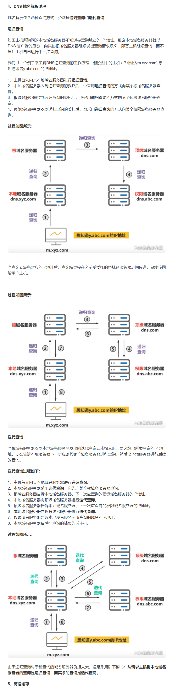
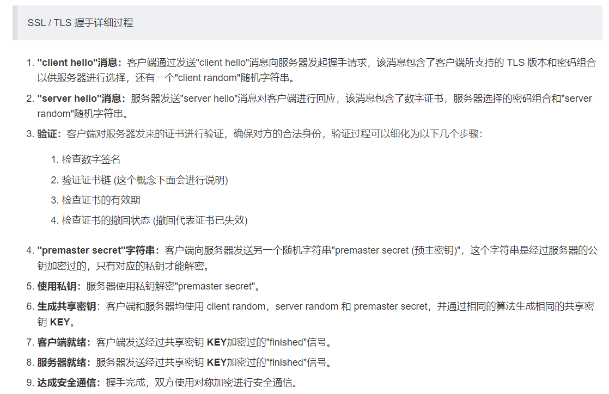
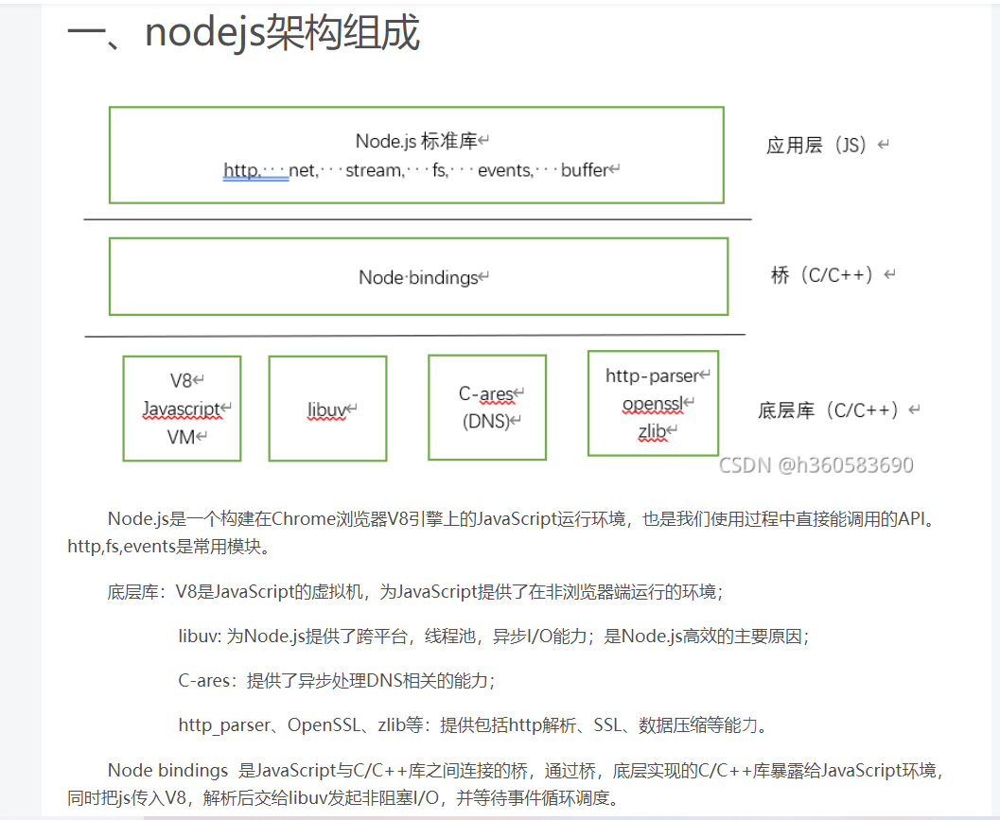
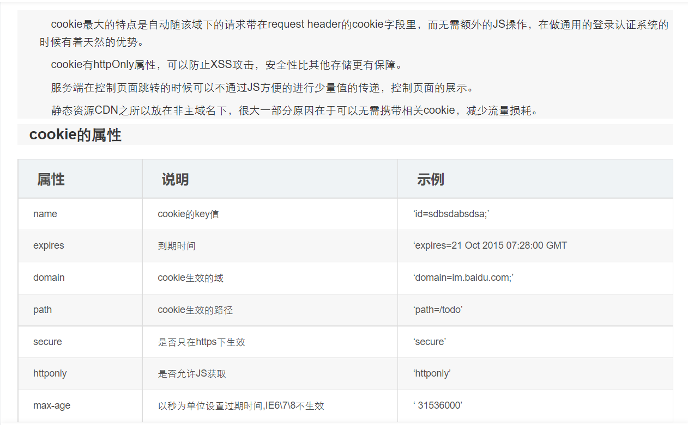
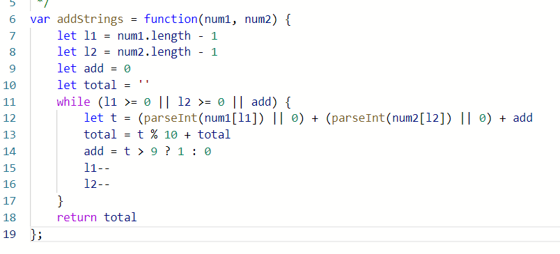
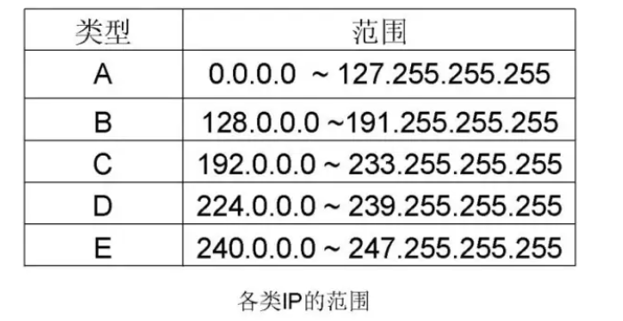
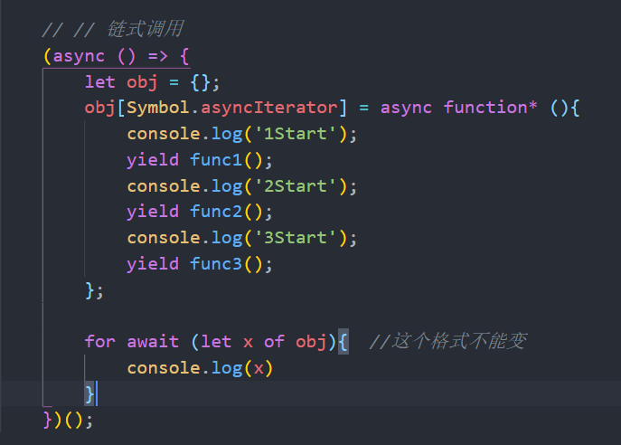

1. 继承方法

2. 在JS中为什么0.1 + 0.2 > 0.3 ?
          因为在JS中，浮点数使用的是64位固定长度表示的，其中的一位表示符号位，11位用来表示指数位，剩下的52位是尾数位。
          由于只有52位表示尾数位，而0.1转为二进制是一个无限循环数0.0001100110011001100...（1100循环）。

          要知道，小数的十进制转二进制的方法是和整数不一样的：
   小数的十进制转二进制。
          由于只能存储52位尾数位，所以会出现精度缺失，把它存到内存中再取出来转换成十进制就不是原来的0.1了；
   而是变成0.100000000000000005551115123126，

          为什么0.1 + 0.2 > 0.3,是因为，0.1和0.2都是转化成二进制后再进行运算，运算结果转成十进制正好是0.30000000000000004

3. 括号

4. DNS查询服务器的基本流程
      假定域名为m.xyz.com的主机想知道另一台主机（域名为y.abc.com）的IP地址。例如，主机m.xyz.com打算发邮件给y.abc.com，此时，必须知道主机y.abc.com的IP地址：
      ①主机m.xyz.com先向其本地域名服务器进行递归查询。
      ②本地域名服务器采用迭代查询。它先向一个根域名服务器查询。
      ③根域名服务器告诉本地域名服务器下一次该查询的顶级域名服务器的IP地址。
      ④本地域名服务器向顶级域名服务器进行查询。
      ⑤顶级域名服务器告诉本地域名服务器下一次应查询的权限域名服务器的IP地址。
      ⑥本地域名服务器向权限域名服务器进行查询。
      ⑦权限域名服务器告诉本地域名服务器所查询的主机的IP地址。
      ⑧本地域名服务器最后把查询结果告诉主机m.xyz.com。

4. 

4. csrf防范，跨站请求伪造 ,   token

   Referer验证: Referer指的是网页请求来源，意思是，只接受本站的请求，服务器才做响应;如果不是，就拦截。

   XSS防范： 对用户收入内容进行限制， 

5. SQL 注入攻击， 

   Dos 拒绝服务攻击（Denial of Service attack）是一种能够让服务器呈现静止状态的攻击方式。其原理就是发送大量的合法请求到服务器，服务器无法分辨这些请求是正常请求还是攻击请求，所以会照单全收。海量的请求造成服务器进入停止工作或拒绝服务的状态。

   DDoS：分布式拒绝服务攻击（Distributed Denial of Service），DDos攻击是在 DOS 攻击基础上的，可以通俗理解，dos 是单挑，而 ddos 是群殴，因为现代技术的发展，dos攻击的杀伤力降低，所以出现了DDOS，攻击者借助公共网络，将大数量的计算机设备联合起来，向一个或多个目标进行攻击。

5. 不连续子数组和（乱序数组，找不连续位序的最大子数组和）

5. SSl, TLS

5. 客户端向服务器传送TLS的协议的版本号、加密算法的种类，产生的随机数、以及其他服务器和客户端之间通信的各种信息。
   服务端向客户端传送TLS协议的版本号、加密算法的种类、随机数以及其他相关信息，同时服务器还将客户端传送自己的证书。
   客户利用服务器传过来的信息验证服务器的合法性。如果合法性没有通过，通信将断开；弱国合法性验证通过，将继续进行4。
   用户随机产生一个用于后面通信的“对称密码”，然后用服务器的公钥对其加密，然后将加密后的“预主密码”传给服务器。
   如果服务器要求客户的身份认证，用户可以建立一个随机数然后对其进行数据签名，将这个含有签名的随机数和客户自己的证书以及加密过的“预主密码”一起传给服务器
   服务器和客户端用相同的主密码，一个对称密钥用于TLS协议的安全数据通讯的加解密通信。同时在TLS通信过程中还要完成数据通信的完整性，防止数据通信中的各种变化。
   
11. 

12. for in 和 for of的区别:

    区别一：for in 和 for of 都可以循环数组，for in 输出的是数组的index下标，而for of 输出的是数组的每一项的值。

    区别二：for in 可以遍历对象，for of 不能遍历对象，只能遍历带有iterator接口的，例如Set,Map,String,Array

​	   for in适合遍历对象，for of适合遍历数组。for in遍历的是数组的索引，对象的属性，以及原型链上的属性。

12. 印象中是
    输入[1,2,3,4] 3
    输出[[1,2,3],[1,2,4],[2,3,4]]; 

13. 手写Promise.all方法

14. 手写jsonp

15. nodejs架构

16. node创建线程，创建进程

17. diff算法，复杂度

18. 三次握手，四次挥手

19. 401 表示用户没有权限(令牌,用户名,密码错误)

    403 表示用户有权限 ,只是访问是被禁止的,(可以理解为,用户有权限,但是某些目录禁止访问)

20. cookie的常见应用场景包括:

    - 判断用户是否已经登录
    - 记录用户登录信息(比如用户名，上次登录时间）
    - 记录用户搜索关键词

21. forEach, map

22. 实现reduce

23. [回文数字](https://www.nowcoder.com/jump/super-jump/word?word=回文数字)

24. 

25. 实现大数想加,

    

26. 实现一个深拷贝（用的递归）

27. flex布局，父元素和子元素分别有哪些属性

12. 实现for  of   可以迭代对象

13. js处理并行请求   https://blog.nowcoder.net/n/05fc2ced5df7495b894f0a9eb1352626

14. 

    接口不使用缓存，只有静态资源，图片、css、js等使用缓存。缓存规则分为http1.0版本和http1.1版本
    **http1.0**

    - 强缓存，expires，有效时间内获取本地缓存。若无强缓存活强缓存超过有效期，使用协商缓存。 
    - 协商缓存，Last-Modified 响应头，If-Modified-Since 请求头，该值就是服务器端上一次响应资源中的Last-Modified字段值。当服务端返回304，没过期，使用本地资源。服务端返回200、新的Last-Modified和最新资源，表示资源已过期，使用最新资源。 

    **http1.1**

    - Cache-Control  
      - no-store 永远不缓存 
      - no-cache 协商缓存，询问服务器是否可用本地缓存，配合Last-Modified或者Etag 
      - max-age 强缓存 覆盖http1.0的Expires 
    - Etag/If-None-Match，覆盖http1.0的Last-Modified/If-Modified-Since  
      - Etag 响应头 服务器资源哈希值 
      - If-None-Match 请求头 If-None-Match字段的值就是服务器端上一次响应资源中的Etag字段值；max-age或者expires过期了才使用，服务端返回304，没过期，使用本地资源。服务端返回200、新的Etag和最新资源，表示资源已过期，使用最新资源。 

    若请求头，响应头中http1.0和http1.1表示缓存的字段都存在，测后者覆盖前者

15. CSS实现中间自适应，两边固定300px(手写代码

16. 求[二叉树](https://www.nowcoder.com/jump/super-jump/word?word=二叉树)的公共父节点

17. 图片加载失败兜底图

    ```html
    
    ```

    ```js
    export default {
      name: 'Home',
      components: {},
      data() {
        return {
          defaultImg: `this.remove()`
        }
      }
    }
    ```

    

    ```html
    imgError(e)} />
    ```

    ```js
    const imgError = (e, isShow, src) => {
        if(!isShow){
            e.target.style.display = 'none'
        }else if(src){
            e.target.src = src
        }
    }
    ```

18. 占2个字节的：带有附加符号的拉丁文、希腊文、西里尔字母、亚美尼亚语、希伯来文、阿拉伯文、叙利亚文及它拿字母则需要二个字节编码

    占3个字节的：基本等同于GBK，含21000多个汉字

    占4个字节的：中日韩超大字符集里面的汉字，有5万多个

    一个utf8数字占1个字节

    一个utf8英文字母占1个字节

    少数是汉字每个占用3个字节，多数占用4个字节。

19. http常见头部字段

    **通用首部字段**
    1.请求指令cache-control : no-cache no-store max-age
    响应指令cache-control : no-cache no-store max-age s-maxage public private
    2.connection: keep-alive close
    3.Date 首部字段 Date 表明创建 HTTP 报文的日期和时间。
    **请求首部字段**
    1.Accept 首部字段可通知服务器，用户代理能够处理的媒体类型及媒体
    类型的相对优先级，若想要给显示的媒体类型增加优先级，则使用 q= 来额外表示权重值
    1，用分号（;）进行分隔。权重值 q 的范围是 0~1（可精确到小数点
    后 3 位），且 1 为最大值。不指定权重 q 值时，默认权重为 q=1.0。
    2.Accept-Charset 首部字段可用来通知服务器用户代理支持的字符集及
    字符集的相对优先顺序。
    3.Accept-Encoding 首部字段用来告知服务器用户代理支持的内容编码及
    内容编码的优先级顺序。

    4. Accept-Language 首部字段 Accept-Language 用来告知服务器用户代理能够处理的自然
    语言集（指中文或英文等）
    5.Authorization 首部字段 Authorization 是用来告知服务器，用户代理的认证信息（证
    书值）。
    6.Host 首部字段 Host 会告知服务器，请求的资源所处的互联网主机名和端口号。
    7.If-Modified-Since
    8.If-None-Match
    9.User-Agent首部字段 User-Agent 会将创建请求的浏览器和用户代理名称等信息传
    达给服务器
    响应首部字段
    1.Accept-Ranges 首部字段 Accept-Ranges 是用来告知客户端服务器是否能处理范围请求，以指定获取服务器端某个部分的资源。可指定的字段值有两种，可处理范围请求时指定其为 bytes，反之则
    指定其为 none。
    2.Age 首部字段 Age 能告知客户端，源服务器在多久前创建了响应。字段值
    的单位为秒。
    3.ETag 首部字段 ETag 能告知客户端实体标识。服务器会为每份资源分配对应的 ETag
    值。资源改变，Etag值也会变。
    4.Location 几乎所有的浏览器在接收到包含首部字段 Location 的响应后，都会强
    制性地尝试对已提示的重定向资源的访问

    **实体首部字段**
    1.Allow 首部字段 Allow 用于通知客户端能够支持 Request-URI 指定资源的所有 HTTP 方法。当服务器接收到不支持的 HTTP 方法时，会以状态码405 Method Not Allowed 作为响应返回
    2.Content-Type首部字段 Content-Type 说明了实体主体内对象的媒体类型段 Accept 一样，字段值用 type/subtype 形式
    3.Expires 首部字段 Expires 会将缓存资源失效的日期告知客户端。
    4.Last-Modified 首部字段 Last-Modified 指明资源最终修改的时间。

    **Cookie首部字段**
    set-cookie和cookie
    set-cookie中设置httpOnly
    Cookie 的 HttpOnly 属性是 Cookie 的扩展功能，它使 JavaScript 脚本
    无法获得 Cookie。其主要目的为防止跨站脚本攻击（Cross-site
    scripting，XSS）对 Cookie 的信息窃取。

20. IP地址相关

    IP地址是一个32位的二进制数，通常被分割为4个“8位二进制数”（也就是4个字节）。IP地址通常用“点分十进制”表示成（a.b.c.d）的形式，其中，a,b,c,d都是0~255之间的十进制整数。

    例：点分十进IP地址（100.4.5.6），实际上是32位二进制数（01100100.00000100.00000101.00000110）。

    IP地址（英语：Internet Protocol Address）是一种在Internet上的给主机编址的方式，也称为网络协议地址。常见的IP地址，分为IPv4与IPv6两大类。

    1、ip地址范围不同

    A类IP段：0.0.0.0 到 127.255.255.255 (0 段和 127 段不使用 )。

    B类IP段：128.0.0.0 到 191.255.255.255，

    C类IP段：192.0.0.0 到 223.255.255.255。

    A类适用的类型为大型网络；

    B类适用的类型为中型网络；

    C类适用的类型为小型网络。

    

21. CDN与DNS的关系

    如果单独使用DNS解析，直接PING就会暴露对应站点的真实IP。但若配合使用CDN就可以轻松隐藏站点真实IP，因为这时PING出来的仅是CDN服务器的IP节点。

    其实，CDN服务并不具备DNS解析功能，而是基于DNS智能解析功能，由由DNS根据用户所在地、所用线路进行智能分配最合适的CDN服务节点，然后把缓存在该服务节点的静态缓存内容返回给用户。

    所以，在启用CDN后进行PING查询时IP发生变化，是因为返回的IP是根据用户所在网络和服务器等情况智能适配后得出的最佳CDN服务节点IP，而非真实服务器。

22. 小数转二进制

    将一个小数如：235.725的小数部分0,725取出，乘以进制数二进制2后得到1.45，取整数1为二进制小数第一项，在将小数部分0.45乘2得0.9，取整数小数第二位0，在将其小数部分0.9乘2，得1.8，取整数部分小数第三位1，取小数部分0.8再乘2……以此类推，直到值为0或形成循环小数停止。

23. JS中如何创建一个可读的对象 -> 本来我答的是 Object.defineProperty，后来答到了Object.freeze()

24. 求两个整数数组中的公共数字

25. 两个栈模拟队列的出队和入队

26. dns请求的具体过程，本地dns服务器怎么查到根域名服务器的

    dns缓存的更新过程

27. http3
    进程、线程和协程

    将线程中的代码继续细分为多个任务，然后像时间片轮转一样不断去执行这些任务。不同的是，线程切换是由操作系统的时间片控制的，而协程是程序自己实现的。
     协程的切换不是按照时间来算的，而是按照代码既定分配，就是说代码运行到这一行才启动协程，协程是可以由我们程序员自己操控的。

    - 线程可以有多个协程，但同一时间内只能运行一个协程。
    - 线程是系统调度，协程是应用自己调度。

    js 中的生成器利用的就是协程，利用协程，可以实现函数暂停执行和函数恢复执行。

    进程间的通信

28. tcp和udp的差别，各举出一个例子

    UDP协议的应用如下：

    　　QQ语音

    　　QQ视频

    　　TFTP

29. 一个数组，长度问n，分成m份，每一份的和要相等，问m的最大值和数组切分的情况

30. 前后端分离的理解?

    总结：前后端分离就是将一个单体应用拆分成两个独立的应用：前端应用和后端应用，以JSON格式进行数据交互

    https://zhuanlan.zhihu.com/p/408362781

31. npm run serve做了什么。

32. npm run serve就相当于执行``vue-cli-service serve命令。这里我们也可以将serve改为dev然后执行npm run dev`，效果是一样的。

    可我执行在命令行下输入vue-cli-service是无效的，那npm run serve是如何启动的呢？原来运行npm run serve命令时npm会把node_modules下的.bin目录添加到Path，执行完后再删掉。

    node_modules\.bin\vue-cli-service相当于一个快捷方式，它被添加到了环境变量，但它指向的是node_modules\@vue\cli-service\bin\vue-cli-service.js。

    综上所述，npm run serve就是在运行vue-cli-service.js这个js文件

    **service.js**

    `vue-cli-service.js`即创建了`service`并对象调用了它的`run` 方法。`Service`类定义位于`\node_modules\@vue\cli-service\lib\Service.js`.

    通过vue-cli-service中的new Service，加载插件信息，缓存到Service实例的plugins变量中。
    当得到命令行参数后，在通过new Service的run方法，异步执行命令。run 方法调用init方法项目配置信息。init方法又调用node_modules\@vue\cli-service\lib\PluginAPI.js中的PluginAPI.js类，关联Service和插件，并存放关系到Service.commands中，最后commands[cmdArgName]调用该方法，完成插件调用。

33. 3个盒子，中间盒子定长等宽，左右两个盒子自动填充宽度

34. 计算函数的执行时间（我是在函数内获取当前时间戳，调用了这个函数后再获取一次时间戳，但是面试官提示还存在函数增强，当时太紧张，没思考出来，然后面试官换了一个题）

    console.time("aaa"); foo();  // 要执行的函数 console.timeEnd("aaa");

    console.time()和console.timeEnd()接受一个字符串作为参数，该字符串相当于计时的id。浏览器会将拥有相同参数(id)的console.time()与console.timeEnd()进行配对，记录两者之间的时间差。因此，可以通过使用不同的id来对JavaScript程序中不同的地方进行计时。

35. 字符串压缩，把‘aaaabbccc’转化为'4a2b3c'

36. 实现居中怎么做 transform啥作用

37. JSON.parse会有什么问题

    ```js
    var jsonStr = '{"sex":"男","info":"我\\是好人"}';
    JSON.parse(jsonStr);
    // 反斜杠就会报错， 字符串转json
    ```

    https://www.cnblogs.com/jun-tao/p/3707663.html

38. 引起内存泄漏的原因

    javascript内存泄漏的原因：1、全局变量使用不当；2、闭包使用不当；3、延时器或定时器没有被清除；4、没有清理的DOM元素引用（dom清空或删除时，事件未清除）。

    解决方法：

    方法一：将事件处理函数定义在外部，解除闭包

    方法二：在定义事件处理函数的外部函数中，删除对dom的引用，《JavaScript权威指南》中介绍过，闭包中，作用域中没用的属性可以删除，以减少内存消耗。

    在页面 onunload 事件中释放 document.getElementById('myDiv').myProp = null

39. try  catch能捕获到timeOut吗？

    https://zhuanlan.zhihu.com/p/142932660

40. form表单的提交如果要阻止，可以怎么做（说了个beforeDestory，然后还有哈希值，哈希值的原理不太清楚）

    1. `<button>` 提交时，type默认为submit，阻止提交将type改为button，即 `type="button"`
    2. `<input>` 提交时，将type改为button，即 `type="button"`
    3. 在提交按钮上绑定点击事件，使用 preventDefault() 方法
    4. 在提交按钮上，使用 `return false;`

41. fs.read(file,()=>{}) 改成同步

    var fs = require('fs');
    var contentText = fs.readFileSync('123.txt','utf-8');
    console.log(contentText);

    

    //流方式读出

    var rf = fs.createReadStream("./1.txt");
    var body = "";
    rf.on("data",(thunk)=>{
      console.log(thunk);
      body += thunk;
    })

    rf.on("end",()=>{
      console.log(body);
    })

42. 实现sleep(5)

    ```js
    Promise.sleep = function(timeout){
        return new Promise((resolve)=>{
            setTimeout(() => {
                resolve()
            }, timeout);
        });
    };
    
    async ƒ a(){
      for(let i = 0; i < 10; i++){
        await Promise.sleep(1000);
        console.log(i)
      }
    }
    ```

43. vue双向绑定的源码

44. 页面加载进度条

45. websocket断线重连

46. 单文件组件与非单文件组件

47. concat 、 every、 filter、 forEach 、indexOf 、 lastIndexOf、 join 、 map 、pop 、push 、reduce 、 reverse 、 slice、splice、shift、 some、sort、 toLocaleSTring、 toString 、 unshift、shift

48. 查找资料后，知道 Cookie 相对于LocalStorage 和 SessionStorage ，是不会对端口做区分的。

    HTTP cookie端口是否特定

    1.介绍

    由于历史原因，cookie包含许多安全和隐私信息。例如，服务器可以指示给定的cookie用于“安全”连接，但Secure属性在存在活动网络攻击者时不提供完整性。 同样，给定主机的cookie在该主机上的所有端口之间共享，即使Web浏览器使用的通常的“同源策略”隔离了通过不同端口检索的内容。
    …

    8.5 弱机密性

    Cookie不提供端口隔离。如果cookie在一个端口上运行的服务可读，则cookie也可由在同一服务器的另一个端口上运行的服务读取。如果cookie在一个端口上可由服务写入，则cookie也可由在同一服务器的另一个端口上运行的服务写入。出于这个原因，服务器不应该在同一主机的不同端口上运行相互不信任的服务，并使用cookie来存储安全敏感信息。

49. webview 和 appService两个线程，  webview中的页面怎么跳回小程序中

50. Set，Map区别:

51. 有哪些排序算法，复杂度如何，说一说逻辑

52. async和defer:

    DOMContentLoaded触发后才执行defer, 

    defer与async的区别是：前者要等到整个页面正常渲染结束，才会执行；后者一旦下载完，渲染引擎就会中断渲染，执行这个脚本以后，再继续渲染。一句话，defer是“渲染完再执行”，async是“下载完就执行”。另外，如果有多个defer脚本，会按照它们在页面出现的顺序加载，而多个async脚本是不能保证加载顺序的。

53. Map,  Set

54. 异步的链式调用

    

12. VueRouter如何实现单页

13. 解析URL参数

14. 包的加载

    优先从缓存加载
    核心模块
    路径形式的文件模块
    第三方模块
    按照这个规则。。。

15. ```js
    if(height.length < 2){
            return 0
        }
        let left = 0, right = height.length - 1, max = 0;
        while(left < right){
            let tmp = Math.min(height[left], height[right]) * (right - left);
            max = Math.max(tmp, max)
            if(height[right] > height[left]){
                left++
            }else{
                right--
            }
        }
        return max
    ```

16. ```js
    function add(a,b){
        return a + b;
    }
    var currys = function(fn,args = []){
        var length = fn.length; //计算期望函数的参数长度
        args =args; //利用闭包特性保存参数
        return function(){
            newArgs = [].slice.call(arguments); //将自身函数参数赋给新参数
            [].push.apply(newArgs,args); //将上回保留的参数push进新的数组
            if(newArgs.length<length){ //判断当前函数的参数是否与期望函数参数一致
                return curry.call(this,fn,newArgs); //如果不够，递归调用
            }else{
                return fn.apply(this,newArgs); // 如果够，就执行期望函数
            }
        }
    }
    var addcurry = currys(add);
    console.log(addcurry(1)(2));
    ```

    
